# MCP Bridge

[](https://golang.org)
[](LICENSE)
[](COVERAGE.md)
[](docs/OWASP_SECURITY.md)
[](docs/PRODUCTION_READINESS.md)
[](https://goreportcard.com/report/github.com/actual-software/mcp-bridge)

A production-ready bridge system for the [Model Context Protocol (MCP)](https://modelcontextprotocol.io), enabling secure remote access to MCP servers through a scalable gateway architecture.

## 🚀 Quick Start

### Development Setup (< 5 minutes)
```bash
git clone https://github.com/actual-software/mcp-bridge.git
cd mcp-bridge
./scripts/quickstart.sh        # Automated setup with interactive wizard
```

The quickstart script will:
- ✅ Check system requirements and dependencies
- 📦 Install missing tools (with your permission)
- 🔧 Generate default configurations
- 🔨 Build Gateway and Router binaries
- 🐳 Set up Docker services (Redis, Prometheus, Grafana)
- 🚀 Start all services
- 🏥 Verify health endpoints
- 📚 Show next steps and useful commands

**[Full Quick Start Documentation →](docs/QUICKSTART.md)**

### Production Installation
```bash
# System-wide installation with systemd
sudo ./scripts/install.sh --environment production --yes

# Deploy with Helm (Kubernetes)
helm install mcp-bridge ./helm/mcp-bridge -f helm/mcp-bridge/values-production.yaml

# Deploy with Docker Compose
docker-compose up -d
```

**[Installation Guide →](docs/installation-and-setup.md)**

## 🏗️ Architecture

MCP Bridge provides universal protocol support, enabling any MCP client to connect to any MCP server regardless of protocol through a scalable gateway architecture:

```mermaid
graph LR
    subgraph "Client Layer"
        Client[MCP Client<br/>━━━━━━━━<br/>Any Protocol<br/>• stdio<br/>• WebSocket<br/>• HTTP<br/>• SSE]
    end

    subgraph "Router Layer"
        Router[Router<br/>━━━━━━━━<br/>• Direct Connections<br/>• Protocol Detection<br/>• Connection Pooling<br/>• Secure Storage<br/>• Auto-reconnect]
    end

    subgraph "Gateway Layer"
        Gateway[Gateway<br/>━━━━━━━━<br/>• Universal Backend<br/>• Load Balancing<br/>• Health Monitoring<br/>• Auth & Rate Limit<br/>• Circuit Breakers<br/>• Service Discovery]
    end

    subgraph "Server Layer"
        Server[MCP Server<br/>━━━━━━━━<br/>Any Protocol<br/>• stdio<br/>• WebSocket<br/>• HTTP<br/>• SSE]
    end

    Client -->|Protocol<br/>Bridge| Router
    Router -->|WebSocket/TCP<br/>Connection| Gateway
    Gateway -->|Protocol-Aware<br/>Routing| Server

    style Client fill:#e1f5ff,stroke:#0066cc,stroke-width:2px
    style Router fill:#fff4e1,stroke:#ff9900,stroke-width:2px
    style Gateway fill:#e1ffe1,stroke:#00cc66,stroke-width:2px
    style Server fill:#ffe1f5,stroke:#cc0099,stroke-width:2px
```



### Protocol Support

#### Router Direct Connections
The Router supports direct connections to local MCP servers using:
- **stdio** - Subprocess-based servers
- **WebSocket** - WebSocket protocol servers (ws/wss)
- **HTTP** - HTTP-based MCP servers
- **SSE** - Server-Sent Events servers

#### Gateway Backend Support
The Gateway routes requests to backend MCP servers using:
- **stdio** - Subprocess-based servers
- **WebSocket** - WebSocket protocol servers
- **HTTP** - HTTP-based MCP servers
- **SSE** - Server-Sent Events servers

#### Client Connection Methods
Clients connect to the Gateway using any of these native frontend protocols:
- **WebSocket** (port 8443) - Full bidirectional communication
- **HTTP** (port 8080) - REST-style request/response
- **SSE** (port 8081) - Server-Sent Events streaming
- **TCP Binary** (port 8444) - High-performance wire protocol
- **stdio** - Process/CLI integration

#### Performance Characteristics
- **Direct Connections**: Reduced latency by bypassing gateway for local servers
- **Concurrent Connections**: 10,000+ simultaneous connections tested
- **Memory Optimization**: Efficient connection pooling and object reuse

### 🔧 Router (`services/router`)
The client-side component that bridges local MCP clients to remote servers with universal protocol support.

**Key Features:**
- 🔐 **Secure Credential Storage** - Platform-native keychains (macOS Keychain, Windows Credential Manager, Linux Secret Service)
- 🔄 **Connection Management** - Automatic reconnection, connection pooling, health checks
- 🚀 **Direct Protocol Support** - Direct connections to stdio, WebSocket, HTTP, SSE servers
- 🌐 **Gateway Integration** - WebSocket and TCP Binary connections to remote gateways
- 🎯 **Protocol Auto-Detection** - Automatic identification of MCP server protocols
- 📊 **Advanced Observability** - Built-in metrics, structured logging, distributed tracing support
- 🛡️ **Enhanced Resilience** - Rate limiting, request deduplication, circuit breakers
- ⚡ **Performance Optimization** - Memory optimization, timeout tuning, connection pooling

### 🌐 Gateway (`services/gateway`)
The server-side component that provides universal protocol routing to any backend MCP server.

**Key Features:**
- 🔐 **Multi-Protocol Authentication** - Bearer tokens, OAuth2 with introspection, mTLS
- ⚖️ **Load Balancing** - Intelligent load balancing across backend servers
- 🔄 **Advanced Fault Tolerance** - Circuit breakers, retries, timeouts with graceful degradation
- 📈 **Horizontal Scalability** - Redis session storage for multi-instance deployments
- 🔍 **Service Discovery** - Kubernetes, Consul, and static configuration support
- 🛡️ **Health Monitoring** - Comprehensive health checks for orchestration systems
- 📊 **Full Observability** - Metrics, logging, distributed tracing support
- 🚀 **Backend Protocol Support** - stdio, WebSocket, HTTP, SSE server connectivity

## 🔒 Enterprise-Grade Security

### **Security Tooling & Compliance** 🛡️
- **10+ Automated Security Tools** - SAST (Gosec, Semgrep, Staticcheck), Container Security (Trivy, Grype), Dependency Scanning (OSV Scanner, OWASP Dependency Check, govulncheck), IaC Security (Checkov, Terrascan), Secret Detection (TruffleHog)
- **SBOM Generation** - Automated Software Bill of Materials with CycloneDX and SPDX formats
- **Compliance Reports** - SOC2, ISO 27001, PCI-DSS, HIPAA, GDPR alignment assessments
- **Comprehensive Threat Model** - STRIDE analysis with 36 threat scenarios
- **Real-time Security Monitoring** - 24/7 automated alerting with Prometheus
- **Incident Response Framework** - Professional response procedures and playbooks

### **Transport Security**
- **End-to-end Encryption** - TLS 1.3 with configurable cipher suites
- **Protocol Version Negotiation** - Secure version handshake for binary protocol
- **Certificate Management** - Automatic renewal with cert-manager support

### **Authentication & Authorization**
- **Multi-factor Authentication** - Bearer, OAuth2, mTLS, per-message auth
- **Token Validation** - JWT verification with issuer/audience checks
- **Zero-Trust Architecture** - mTLS between all components

### **Application Security**
- **Input Validation** - Comprehensive validation preventing injection attacks
- **Request Size Limits** - DoS protection with configurable limits
- **Security Headers** - Automatic security headers on all HTTP responses
- **Vulnerability Management** - Automated scanning with suppression framework

### **Operational Security**
- **Multi-layer Rate Limiting** - Per-IP, per-user, and circuit breaker protection
- **DDoS Protection** - Connection limits, request throttling, auto-scaling
- **Resource Monitoring** - CPU/memory limits with anomaly detection
- **Audit Logging** - Comprehensive security event tracking

## 🚀 Getting Started

### Prerequisites

- **Go 1.25.0+** (toolchain 1.25.0 recommended) - For building from source
- **Docker** 24.0+ - For containerized deployment
- **kubectl** 1.24+ - For Kubernetes deployment
- **Kubernetes** 1.24+ (optional) - For production deployment
- **Redis** 7.0+ (optional) - For session storage and rate limiting
- **Helm** 3.10+ (optional) - For Kubernetes package management

### Installation Options

#### Option 1: Download Pre-built Binaries
```bash
# Download latest release
curl -sSL https://github.com/actual-software/mcp-bridge/releases/latest/download/install.sh | bash

# Or install specific version
VERSION=v1.0.0 curl -sSL https://github.com/actual-software/mcp-bridge/releases/download/${VERSION}/install.sh | bash
```

#### Option 2: Build from Source
```bash
git clone https://github.com/actual-software/mcp-bridge.git
cd mcp-bridge

# Build router
cd services/router
make build

# Build gateway
cd ../gateway
make build
```

#### Option 3: Docker
```bash
# Run with Docker Compose (Recommended)
git clone https://github.com/actual-software/mcp-bridge.git
cd mcp-bridge
docker-compose up -d

# Or run individual containers
docker run -p 8443:8443 ghcr.io/actual-software/mcp-bridge/gateway:latest
docker run -v ~/.config:/root/.config ghcr.io/actual-software/mcp-bridge/router:latest
```

### Configuration

#### Router Setup
```bash
# Interactive setup
mcp-router setup

# Or create config manually
cat > ~/.config/mcp-router/config.yaml << EOF
gateway:
  url: wss://your-gateway.com
  auth:
    type: bearer
    token_store: keychain
servers:
  - name: my-server
    command: ["/path/to/my-server"]
EOF
```

#### Gateway Deployment
```bash
# Deploy with Helm (Recommended)
helm install mcp-bridge ./helm/mcp-bridge

# Deploy with Kubernetes manifests
kubectl apply -k deployments/kubernetes/

# Or run with Docker Compose
docker-compose up -d
```

## 📚 Documentation

### **Core Documentation**
- [**📖 Documentation Index**](docs/README.md) - Complete documentation navigation
- [**📘 Usage Guide**](docs/USAGE.md) - How to use MCP Bridge
- [**🔌 Client Integration**](docs/client-integration.md) - Build clients for MCP Bridge
- [**🔧 Server Integration**](docs/server-integration.md) - Add MCP servers to the gateway
- [**⚙️ Configuration Reference**](docs/configuration.md) - All configuration options
- [**📚 Tutorials**](docs/tutorials/) - Step-by-step guides
- [**🏗️ Service Documentation**](services/) - Gateway and Router architecture and design
- [**🧪 Testing Guide**](TESTING.md) - Comprehensive testing documentation
- [**🚀 Production Readiness**](docs/PRODUCTION_READINESS.md) - Production deployment checklist

### **Security Documentation**
- [**🛡️ OWASP Security**](docs/OWASP_SECURITY.md) - Comprehensive security scanning
- [**🎯 Threat Model**](docs/THREAT_MODEL.md) - STRIDE analysis and risk assessment
- [**🚨 Incident Response**](docs/SECURITY_INCIDENT_RESPONSE.md) - Security incident procedures
- [**🔐 Security Best Practices**](docs/SECURITY.md) - Hardening and configuration

### **Deployment Guides**
- [**🐳 Docker Deployment**](docs/deployment/docker.md) - Container deployment with Docker Compose
- [**⎈ Helm Deployment**](docs/deployment/helm.md) - Kubernetes deployment with Helm charts
- [**☸️ Kubernetes Deployment**](deployment/kubernetes/README.md) - Complete K8s guide with examples
- [**🚀 Production Deployment**](docs/deployment/production.md) - Production-ready deployment

### **Operations & Monitoring**
- [**📊 Configuration Reference**](docs/configuration.md) - All configuration options
- [**📈 Monitoring & Metrics**](docs/monitoring.md) - Prometheus, Grafana, alerts
- [**🔧 Troubleshooting**](docs/troubleshooting.md) - Common issues and solutions
- [**🎛️ Service Documentation**](services/) - Gateway and Router specific docs
- [**🔒 Security Tooling**](docs/security-tooling.md) - Security scanning and compliance
- [**📝 Changelog Guide**](docs/changelog-guide.md) - Automated changelog and releases

## 🔧 Development

### Building
```bash
# Build all services
make build

# Build specific service
make build-gateway
make build-router

# Cross-compile for multiple platforms
make build-all-platforms
```

### Testing

#### Production Testing (Recommended)
```bash
# Run tests with real services in Docker
make -f Makefile.test test-docker

# Quick smoke tests (< 2 minutes)
make -f Makefile.test test-docker-quick

# Full test suite with all services
make -f Makefile.test test-docker-full

# CI/CD pipeline tests
make -f Makefile.test test-ci
```

See [Production Testing Guide](test/PRODUCTION_TESTING.md) for comprehensive testing with real services.

#### Local Testing
```bash
# Run quick tests
make test-short

# Run full test suite
make test-all

# Run with coverage
make test-coverage

# Run specific test categories
make test-load      # Load testing
make test-chaos     # Chaos engineering
make test-fuzz      # Fuzz testing
```

### Local Development
```bash
# Terminal 1: Run gateway
cd services/gateway
make run  # Use 'make run-debug' only for troubleshooting

# Terminal 2: Run router
cd services/router
make run  # Use 'make run-debug' only for troubleshooting

# Terminal 3: Run tests
make test-integration
```

## 📊 Monitoring

### Metrics
Both components expose Prometheus metrics:

- **Router**: `http://localhost:9091/metrics`
- **Gateway**: `http://gateway:9090/metrics`

Key metrics include:
- Connection count and state
- Request rate and latency  
- Error rates by type
- Circuit breaker states
- Authentication success/failure rates

### Health Checks
- **Gateway**: `https://gateway:8443/health`
- **Router**: Built-in connection monitoring with automatic failover

### Observability Stack
```bash
# Deploy monitoring stack
kubectl apply -k deployments/kubernetes/monitoring/

# Access Grafana
kubectl port-forward svc/grafana 3000:3000

# Access Prometheus
kubectl port-forward svc/prometheus 9090:9090
```

## 🚢 Production Deployment

### Kubernetes (Recommended)
```bash
# Deploy with Helm
helm install mcp-bridge ./helm/mcp-bridge -f helm/mcp-bridge/values-production.yaml

# Or with Kustomize
kubectl apply -k deployments/kubernetes/

# Or with Docker Compose
docker-compose -f deployment/local/docker-compose.yml up -d
```

### High Availability Setup
- **Gateway**: Multiple replicas with load balancer
- **Redis**: Cluster mode for session storage
- **Database**: PostgreSQL with read replicas
- **Monitoring**: Prometheus with Grafana dashboards

### Performance Tuning
- **Connection Pooling**: Configurable pool sizes
- **Circuit Breakers**: Tunable thresholds
- **Rate Limiting**: Per-user and global limits
- **Caching**: Redis-based response caching

## 🧪 Testing

The project maintains comprehensive test coverage across multiple categories:

- **Unit Tests**: 69.0% production code coverage with comprehensive service tests
- **Integration Tests**: End-to-end service testing
- **Load Tests**: 10k+ concurrent connections
- **Chaos Tests**: Network partitions, service failures
- **Fuzz Tests**: Protocol message validation
- **Security Tests**: Authentication, authorization, input validation

See [COVERAGE.md](COVERAGE.md) for detailed coverage analysis and [TESTING.md](TESTING.md) for testing documentation.

## 🤝 Contributing

We welcome contributions! Please see our [Contributing Guide](CONTRIBUTING.md) for details.

### Development Process
1. Fork the repository
2. Create a feature branch (`git checkout -b feature/amazing-feature`)
3. Make your changes with tests
4. Run the test suite (`make test-all`)
5. Commit your changes (`git commit -m 'Add amazing feature'`)
6. Push to the branch (`git push origin feature/amazing-feature`)
7. Open a Pull Request

### Code Standards
- **Go**: Follow standard Go conventions and use `gofmt`
- **Testing**: Maintain 80%+ production code coverage
- **Documentation**: Update docs for any API changes
- **Security**: Follow security best practices

## 📄 License

This project is licensed under the MIT License - see the [LICENSE](LICENSE) file for details.

## 🙏 Acknowledgments

- [Model Context Protocol](https://modelcontextprotocol.io) specification
- [Anthropic](https://anthropic.com) for the MCP protocol design
- The Go community for excellent libraries and tools

## 📞 Support

- **Documentation**: Check our [docs](docs/) directory
- **Issues**: Report bugs on [GitHub Issues](https://github.com/actual-software/mcp-bridge/issues)
- **Discussions**: Join our [GitHub Discussions](https://github.com/actual-software/mcp-bridge/discussions)
- **Security**: Report security issues to [poile@actual.ai](mailto:poile@actual.ai)

---

**Star ⭐ this repository if you find it useful!**
