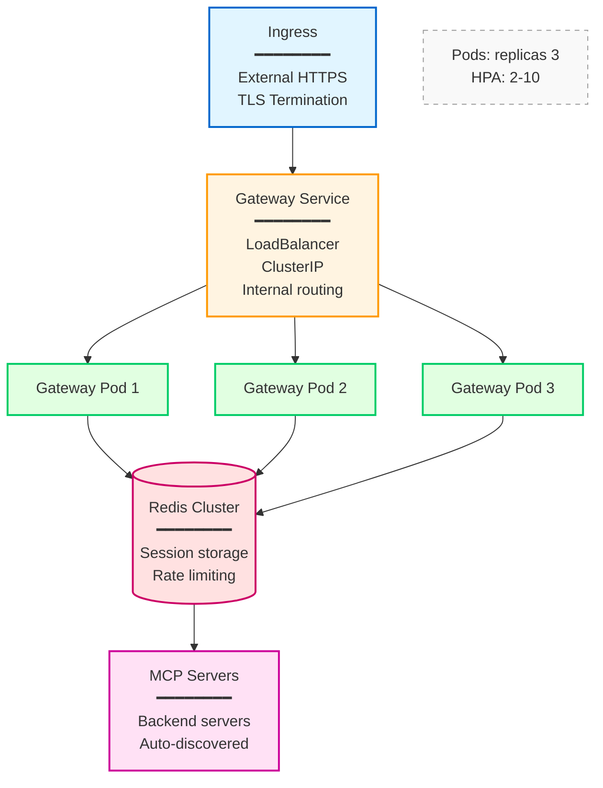

# Kubernetes Deployment Guide

Complete guide for deploying MCP Bridge to Kubernetes with production-ready configurations.

## Table of Contents

- [Quick Deploy](#quick-deploy)
- [Architecture](#architecture)
- [Prerequisites](#prerequisites)
- [Deployment Options](#deployment-options)
- [Configuration](#configuration)
- [Monitoring](#monitoring)
- [Scaling](#scaling)
- [Troubleshooting](#troubleshooting)

## Quick Deploy

Deploy the complete MCP Bridge system:

```bash
# Clone repository
git clone https://github.com/actual-software/mcp-bridge.git
cd mcp-bridge

# Deploy with Kustomize
kubectl apply -k deployment/kubernetes/

# Or deploy with Helm
helm install mcp-bridge deployment/helm/mcp-bridge/
```

This creates:
- `mcp-system` namespace with gateway deployment
- Redis for session storage
- Service discovery and network policies
- Monitoring with ServiceMonitors
- Ingress for external access

## Architecture



## Prerequisites

### Required

- **Kubernetes** 1.24+ cluster
- **kubectl** 1.24+ configured
- **Sufficient resources**:
  - 2 CPU cores
  - 4 GB RAM
  - 10 GB storage

### Optional

- **Helm** 3.10+ for chart-based deployment
- **cert-manager** for automatic TLS certificates
- **Prometheus Operator** for monitoring
- **Ingress Controller** (nginx, traefik, etc.)

### Verify Prerequisites

```bash
# Check Kubernetes version
kubectl version --short

# Check available resources
kubectl top nodes

# Check for cert-manager (optional)
kubectl get pods -n cert-manager

# Check for Prometheus Operator (optional)
kubectl get crd servicemonitors.monitoring.coreos.com
```

## Deployment Options

### Option 1: Kustomize Deployment

**Basic deployment**:

```bash
kubectl apply -k deployment/kubernetes/
```

**Custom overlay**:

```bash
# Create production overlay
mkdir -p deployment/kubernetes/overlays/production

cat > deployment/kubernetes/overlays/production/kustomization.yaml <<EOF
apiVersion: kustomize.config.k8s.io/v1beta1
kind: Kustomization

namespace: mcp-production

resources:
- ../../base

patches:
- path: replica-patch.yaml
- path: resource-patch.yaml
- path: ingress-patch.yaml

configMapGenerator:
- name: gateway-config
  files:
  - gateway.yaml

secretGenerator:
- name: gateway-secrets
  literals:
  - jwt-secret-key=$(openssl rand -base64 32)
EOF

# Apply production overlay
kubectl apply -k deployment/kubernetes/overlays/production/
```

### Option 2: Helm Deployment

**Install from local chart**:

```bash
helm install mcp-bridge deployment/helm/mcp-bridge/ \
  --namespace mcp-system \
  --create-namespace \
  --values deployment/helm/mcp-bridge/values-production.yaml
```

**Install specific version**:

```bash
helm install mcp-bridge deployment/helm/mcp-bridge/ \
  --version 1.0.0 \
  --namespace mcp-production \
  --create-namespace
```

**Customize with values**:

```bash
helm install mcp-bridge deployment/helm/mcp-bridge/ \
  --set gateway.replicaCount=5 \
  --set gateway.ingress.enabled=true \
  --set gateway.ingress.hosts[0].host=mcp.example.com \
  --set redis.master.persistence.size=20Gi
```

### Option 3: Manual Deployment

**Step 1: Create namespace**:

```bash
kubectl create namespace mcp-system
```

**Step 2: Create secrets**:

```bash
# JWT secret
kubectl create secret generic mcp-gateway-secrets \
  -n mcp-system \
  --from-literal=jwt-secret-key="$(openssl rand -base64 32)"

# TLS certificate (if not using cert-manager)
kubectl create secret tls mcp-gateway-tls \
  -n mcp-system \
  --cert=path/to/tls.crt \
  --key=path/to/tls.key
```

**Step 3: Deploy Redis**:

```bash
kubectl apply -f - <<EOF
apiVersion: apps/v1
kind: StatefulSet
metadata:
  name: redis
  namespace: mcp-system
spec:
  serviceName: redis
  replicas: 1
  selector:
    matchLabels:
      app: redis
  template:
    metadata:
      labels:
        app: redis
    spec:
      containers:
      - name: redis
        image: redis:7-alpine
        ports:
        - containerPort: 6379
          name: redis
        volumeMounts:
        - name: data
          mountPath: /data
  volumeClaimTemplates:
  - metadata:
      name: data
    spec:
      accessModes: ["ReadWriteOnce"]
      resources:
        requests:
          storage: 10Gi
---
apiVersion: v1
kind: Service
metadata:
  name: redis
  namespace: mcp-system
spec:
  selector:
    app: redis
  ports:
  - port: 6379
    targetPort: 6379
  clusterIP: None
EOF
```

**Step 4: Deploy Gateway**:

```bash
kubectl apply -f - <<EOF
apiVersion: apps/v1
kind: Deployment
metadata:
  name: mcp-gateway
  namespace: mcp-system
spec:
  replicas: 3
  selector:
    matchLabels:
      app: mcp-gateway
  template:
    metadata:
      labels:
        app: mcp-gateway
    spec:
      containers:
      - name: gateway
        image: ghcr.io/actual-software/mcp-bridge/gateway:latest
        ports:
        - containerPort: 8443
          name: websocket
        - containerPort: 9090
          name: metrics
        env:
        - name: JWT_SECRET_KEY
          valueFrom:
            secretKeyRef:
              name: mcp-gateway-secrets
              key: jwt-secret-key
        - name: REDIS_URL
          value: "redis://redis:6379/0"
        volumeMounts:
        - name: config
          mountPath: /etc/mcp
        resources:
          requests:
            memory: "256Mi"
            cpu: "250m"
          limits:
            memory: "512Mi"
            cpu: "500m"
        livenessProbe:
          httpGet:
            path: /health
            port: 8443
            scheme: HTTPS
          initialDelaySeconds: 10
          periodSeconds: 30
        readinessProbe:
          httpGet:
            path: /health
            port: 8443
            scheme: HTTPS
          initialDelaySeconds: 5
          periodSeconds: 10
      volumes:
      - name: config
        configMap:
          name: gateway-config
---
apiVersion: v1
kind: Service
metadata:
  name: mcp-gateway
  namespace: mcp-system
  annotations:
    prometheus.io/scrape: "true"
    prometheus.io/port: "9090"
spec:
  selector:
    app: mcp-gateway
  ports:
  - name: websocket
    port: 8443
    targetPort: 8443
  - name: metrics
    port: 9090
    targetPort: 9090
  type: LoadBalancer
EOF
```

## Configuration

### Gateway Configuration

Create `gateway.yaml` ConfigMap:

```yaml
apiVersion: v1
kind: ConfigMap
metadata:
  name: gateway-config
  namespace: mcp-system
data:
  gateway.yaml: |
    version: 1

    server:
      host: 0.0.0.0
      port: 8443
      protocol: websocket
      max_connections: 10000
      tls:
        enabled: true
        cert_file: /etc/tls/tls.crt
        key_file: /etc/tls/tls.key

    auth:
      provider: jwt
      jwt:
        issuer: mcp-gateway
        audience: mcp-services
        secret_key_env: JWT_SECRET_KEY

    sessions:
      provider: redis
      redis:
        url: redis://redis:6379/0

    service_discovery:
      provider: kubernetes
      kubernetes:
        in_cluster: true
        namespace_pattern: "mcp-.*"
        service_labels:
          mcp-enabled: "true"
      refresh_rate: 30s

    rate_limit:
      enabled: true
      provider: redis
      requests_per_sec: 1000
      burst: 2000

    metrics:
      enabled: true
      endpoint: 0.0.0.0:9090

    logging:
      level: info
      format: json
```

Apply:
```bash
kubectl apply -f gateway-config.yaml
```

### MCP Server Deployment

Label services for auto-discovery:

```yaml
apiVersion: v1
kind: Service
metadata:
  name: weather-mcp
  namespace: mcp-production
  labels:
    mcp-enabled: "true"
    mcp-namespace: weather
  annotations:
    mcp.bridge/health-check-path: "/health"
spec:
  selector:
    app: weather-server
  ports:
  - port: 8080
    targetPort: 8080

---
apiVersion: apps/v1
kind: Deployment
metadata:
  name: weather-server
  namespace: mcp-production
spec:
  replicas: 2
  selector:
    matchLabels:
      app: weather-server
  template:
    metadata:
      labels:
        app: weather-server
    spec:
      containers:
      - name: server
        image: myregistry/weather-server:1.0.0
        ports:
        - containerPort: 8080
        resources:
          requests:
            memory: "128Mi"
            cpu: "100m"
          limits:
            memory: "256Mi"
            cpu: "200m"
```

### Ingress Configuration

**With cert-manager**:

```yaml
apiVersion: networking.k8s.io/v1
kind: Ingress
metadata:
  name: mcp-gateway
  namespace: mcp-system
  annotations:
    cert-manager.io/cluster-issuer: "letsencrypt-prod"
    nginx.ingress.kubernetes.io/backend-protocol: "HTTPS"
    nginx.ingress.kubernetes.io/websocket-services: "mcp-gateway"
spec:
  ingressClassName: nginx
  tls:
  - hosts:
    - mcp.example.com
    secretName: mcp-gateway-tls
  rules:
  - host: mcp.example.com
    http:
      paths:
      - path: /
        pathType: Prefix
        backend:
          service:
            name: mcp-gateway
            port:
              number: 8443
```

**Manual TLS**:

```yaml
apiVersion: networking.k8s.io/v1
kind: Ingress
metadata:
  name: mcp-gateway
  namespace: mcp-system
spec:
  tls:
  - hosts:
    - mcp.example.com
    secretName: mcp-gateway-tls  # Created manually
  rules:
  - host: mcp.example.com
    http:
      paths:
      - path: /
        pathType: Prefix
        backend:
          service:
            name: mcp-gateway
            port:
              number: 8443
```

## Monitoring

### Prometheus Integration

**Deploy ServiceMonitor**:

```yaml
apiVersion: monitoring.coreos.com/v1
kind: ServiceMonitor
metadata:
  name: mcp-gateway
  namespace: mcp-system
  labels:
    app: mcp-gateway
spec:
  selector:
    matchLabels:
      app: mcp-gateway
  endpoints:
  - port: metrics
    interval: 30s
    path: /metrics
```

**Key Metrics**:

```promql
# Request rate
rate(mcp_gateway_requests_total[5m])

# Error rate
rate(mcp_gateway_errors_total[5m])

# Latency (95th percentile)
histogram_quantile(0.95, rate(mcp_gateway_request_duration_seconds_bucket[5m]))

# Active connections
mcp_gateway_connections_active

# Circuit breaker state
mcp_gateway_circuit_breaker_state
```

### Grafana Dashboard

Import dashboard JSON or create panels:

```json
{
  "dashboard": {
    "title": "MCP Gateway",
    "panels": [
      {
        "title": "Request Rate",
        "targets": [{
          "expr": "sum(rate(mcp_gateway_requests_total[5m]))"
        }]
      },
      {
        "title": "Error Rate",
        "targets": [{
          "expr": "sum(rate(mcp_gateway_errors_total[5m])) / sum(rate(mcp_gateway_requests_total[5m]))"
        }]
      }
    ]
  }
}
```

## Scaling

### Horizontal Pod Autoscaler

```yaml
apiVersion: autoscaling/v2
kind: HorizontalPodAutoscaler
metadata:
  name: mcp-gateway
  namespace: mcp-system
spec:
  scaleTargetRef:
    apiVersion: apps/v1
    kind: Deployment
    name: mcp-gateway
  minReplicas: 3
  maxReplicas: 10
  metrics:
  - type: Resource
    resource:
      name: cpu
      target:
        type: Utilization
        averageUtilization: 70
  - type: Resource
    resource:
      name: memory
      target:
        type: Utilization
        averageUtilization: 80
  behavior:
    scaleUp:
      stabilizationWindowSeconds: 60
      policies:
      - type: Percent
        value: 50
        periodSeconds: 60
    scaleDown:
      stabilizationWindowSeconds: 300
      policies:
      - type: Pods
        value: 1
        periodSeconds: 60
```

### Vertical Scaling

Update resource limits:

```bash
kubectl patch deployment mcp-gateway -n mcp-system --patch '
spec:
  template:
    spec:
      containers:
      - name: gateway
        resources:
          requests:
            memory: "512Mi"
            cpu: "500m"
          limits:
            memory: "1Gi"
            cpu: "1000m"
'
```

### Multi-Region Deployment

Deploy to multiple clusters:

```bash
# Deploy to us-east cluster
kubectl --context us-east apply -k deployment/kubernetes/

# Deploy to eu-west cluster
kubectl --context eu-west apply -k deployment/kubernetes/

# Configure global load balancer (example with AWS)
aws globalaccelerator create-accelerator \
  --name mcp-gateway \
  --ip-address-type IPV4
```

## Troubleshooting

### Gateway Pods Not Starting

```bash
# Check pod status
kubectl get pods -n mcp-system

# View pod events
kubectl describe pod mcp-gateway-xxx -n mcp-system

# Check logs
kubectl logs -n mcp-system deployment/mcp-gateway

# Common issues:
# 1. Image pull errors
kubectl get events -n mcp-system | grep ImagePull

# 2. ConfigMap not found
kubectl get configmap -n mcp-system

# 3. Secret not found
kubectl get secret -n mcp-system
```

### Service Discovery Not Working

```bash
# Check if MCP servers have correct labels
kubectl get services --all-namespaces -l mcp-enabled=true

# Check gateway logs for discovery events
kubectl logs -n mcp-system deployment/mcp-gateway | grep discovery

# Verify namespace pattern in gateway config
kubectl get configmap gateway-config -n mcp-system -o yaml
```

### Connection Issues

```bash
# Test internal connectivity
kubectl run -it --rm debug --image=busybox --restart=Never -- sh
nslookup mcp-gateway.mcp-system
wget -O- http://mcp-gateway.mcp-system:8443/health

# Test external access
curl -k https://mcp.example.com/health

# Check ingress
kubectl describe ingress mcp-gateway -n mcp-system

# Check service endpoints
kubectl get endpoints mcp-gateway -n mcp-system
```

### Performance Issues

```bash
# Check resource usage
kubectl top pods -n mcp-system

# Check HPA status
kubectl get hpa -n mcp-system

# Check for throttling
kubectl describe pod mcp-gateway-xxx -n mcp-system | grep -i throttl

# Increase resources
kubectl patch deployment mcp-gateway -n mcp-system --patch '
spec:
  template:
    spec:
      containers:
      - name: gateway
        resources:
          limits:
            memory: "2Gi"
            cpu: "2000m"
'
```

### Redis Connection Issues

```bash
# Check Redis pod
kubectl get pods -n mcp-system -l app=redis

# Test Redis connectivity
kubectl run -it --rm redis-test --image=redis:7-alpine --restart=Never -- redis-cli -h redis.mcp-system ping

# Check Redis logs
kubectl logs -n mcp-system statefulset/redis
```

## Best Practices

### Security

- ✅ Enable TLS for all connections
- ✅ Use cert-manager for automatic certificate renewal
- ✅ Store secrets in Kubernetes Secrets or external secret managers
- ✅ Enable Network Policies to restrict traffic
- ✅ Use RBAC for service account permissions
- ✅ Regular security scanning of images
- ✅ Enable Pod Security Standards

### High Availability

- ✅ Run multiple gateway replicas (minimum 3)
- ✅ Use Pod Disruption Budgets
- ✅ Deploy across multiple availability zones
- ✅ Use Redis cluster for session storage
- ✅ Configure proper health checks
- ✅ Set resource requests and limits

### Monitoring

- ✅ Deploy ServiceMonitors for Prometheus
- ✅ Create Grafana dashboards
- ✅ Set up alerting rules
- ✅ Enable distributed tracing
- ✅ Aggregate logs centrally

## Additional Resources

- [Helm Deployment Guide](../../docs/deployment/helm.md)
- [Configuration Reference](../../docs/configuration.md)
- [Monitoring Guide](../../docs/monitoring.md)
- [Security Best Practices](../../docs/SECURITY.md)
- [Troubleshooting Guide](../../docs/troubleshooting.md)

## Support

- **Issues**: [GitHub Issues](https://github.com/actual-software/mcp-bridge/issues)
- **Discussions**: [GitHub Discussions](https://github.com/actual-software/mcp-bridge/discussions)
- **Documentation**: [Complete docs](../../docs/)
