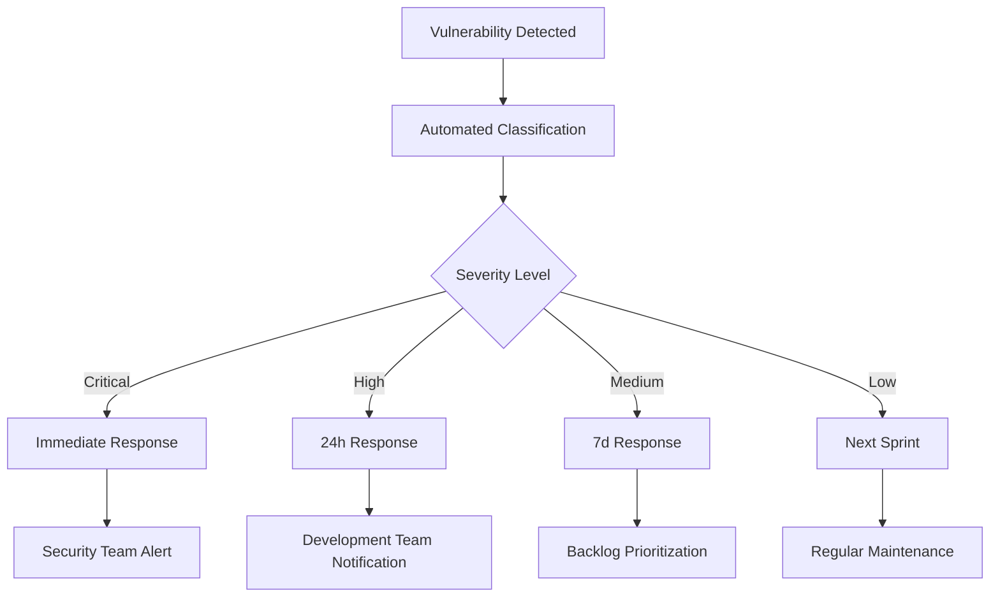

# OWASP Security Implementation

This document describes the comprehensive OWASP (Open Web Application Security Project) security scanning implementation for MCP Bridge, providing automated vulnerability detection and security monitoring.

## 🛡️ **Overview**

MCP Bridge implements a multi-layered security scanning approach using industry-standard OWASP tools to ensure comprehensive vulnerability detection and security compliance. The security pipeline runs automatically on code changes and provides continuous monitoring.

## 🔧 **Security Tools Implemented**

### **1. OWASP Dependency Check**
**Purpose**: Identifies known vulnerabilities in project dependencies
**Coverage**: All Go modules and dependencies
**Configuration**: `.github/workflows/owasp-security.yml`

```yaml
- Scans: go.mod, go.sum, and all dependencies
- Format: SARIF for GitHub Security integration
- Threshold: Fails on CVSS score ≥ 7.0
- Frequency: Daily automated scans + on code changes
```

**Key Features**:
- Known vulnerability database (NVD, OSS Index)
- Severity-based filtering and reporting
- Integration with GitHub Security tab
- Automated suppression handling

### **2. govulncheck (Go Vulnerability Database)**
**Purpose**: Go-specific vulnerability scanning
**Coverage**: All Go code in root, gateway, and router modules
**Integration**: Official Go security team database

```bash
# Scans performed:
govulncheck ./...                    # Root module
govulncheck ./services/gateway/...   # Gateway service  
govulncheck ./services/router/...    # Router service
```

**Key Features**:
- Official Go vulnerability database
- Call graph analysis for reachability
- JSON output for automated processing
- Zero false positives for Go code

### **3. Nancy (Sonatype OSS Index)**
**Purpose**: Community vulnerability scanner
**Coverage**: All Go dependencies
**Database**: Sonatype OSS Index

```bash
# Process:
go list -json -deps ./... > go.list
nancy sleuth --loud < go.list
```

**Key Features**:
- Community-maintained vulnerability database
- Fast dependency analysis
- Complementary to other scanners
- Open source intelligence

### **4. Trivy (Comprehensive Scanner)**
**Purpose**: Multi-purpose vulnerability scanner
**Coverage**: Filesystem, dependencies, and configuration
**Integration**: Aqua Security's vulnerability database

```yaml
Scan Types:
- Filesystem scanning
- Dependency analysis
- Configuration issues
- SARIF output for GitHub
```

**Key Features**:
- Multiple vulnerability databases
- Fast scanning performance
- Configuration issue detection
- Container image scanning support

### **5. Semgrep (Static Analysis)**
**Purpose**: Static application security testing (SAST)
**Coverage**: Source code security patterns
**Rules**: OWASP Top 10, CWE Top 25, Go-specific rules

```yaml
Rule Sets:
- p/security-audit     # General security patterns
- p/golang            # Go-specific security rules
- p/owasp-top-ten     # OWASP Top 10 vulnerabilities
- p/cwe-top-25        # CWE Top 25 dangerous patterns
```

**Key Features**:
- Static code analysis
- Security pattern detection
- Custom rule support
- Low false positive rate

### **6. Snyk (Developer Security)**
**Purpose**: Developer-first security scanning
**Coverage**: Dependencies and code
**Integration**: Snyk vulnerability database

```yaml
Configuration:
- Severity threshold: Medium+
- SARIF output format
- Automated remediation suggestions
- License compliance checking
```

**Key Features**:
- Developer-friendly interface
- Remediation guidance
- License compliance
- IDE integration support

## 🚀 **Automated Scanning Pipeline**

### **Trigger Conditions**
```yaml
# Automated scans run on:
push:
  - branches: [main, develop]
  - paths: ['go.mod', 'go.sum', 'services/**/*.go']

pull_request:
  - branches: [main]
  - paths: ['go.mod', 'go.sum', 'services/**/*.go']

schedule:
  - cron: '0 3 * * *'  # Daily at 3 AM UTC
```

### **Scan Results Integration**
- **GitHub Security Tab**: All SARIF results automatically uploaded
- **Pull Request Checks**: Security scans block merging on failures
- **Artifacts**: Detailed reports stored for 30 days
- **Notifications**: Teams notified of critical findings

## 🔍 **Vulnerability Management Process**

### **1. Detection and Triage**


### **2. Response Timeline**
| Severity | Response Time | Action Required |
|----------|---------------|-----------------|
| **Critical** | Immediate | Security team alert, emergency patch |
| **High** | 24 hours | Development team assigned, fix planned |
| **Medium** | 7 days | Backlog item created, next sprint |
| **Low** | 30 days | Regular maintenance, documentation |

### **3. Suppression Management**
**File**: `owasp-suppressions.xml`
**Process**: 
- All suppressions require justification
- Monthly review process
- Expiration dates for all suppressions
- Risk assessment documentation

```xml
<!-- Example suppression -->
<suppress until="2025-12-31">
    <notes>
        Justification: Library only used in test code
        Risk: None (not in production)
        Mitigation: Isolated test environment
        Review Date: 2025-12-01
    </notes>
    <packageUrl>pkg:golang/github.com/example/test-lib</packageUrl>
</suppress>
```

## 📊 **Security Metrics and Reporting**

### **Key Performance Indicators**
- **Mean Time to Detection (MTTD)**: < 24 hours
- **Mean Time to Response (MTTR)**: < 72 hours  
- **False Positive Rate**: < 5%
- **Coverage**: 100% of dependencies and code
- **Scan Success Rate**: > 99%

### **Dashboard Metrics**
```yaml
Tracked Metrics:
- Total vulnerabilities by severity
- Response time by severity level
- Suppression rates and reasons
- Scanner effectiveness comparison
- Trend analysis over time
```

### **Reporting Schedule**
- **Daily**: Automated scan results
- **Weekly**: Security team summary
- **Monthly**: Executive dashboard
- **Quarterly**: Security posture review

## 🔐 **Security Configuration**

### **Environment Variables**
```bash
# Required for enhanced scanning
SNYK_TOKEN=xxxxx           # Snyk authentication
SEMGREP_APP_TOKEN=xxxxx    # Semgrep Pro features
GITHUB_TOKEN=xxxxx         # GitHub Security integration
```

### **Repository Settings**
```yaml
# Required GitHub repository settings:
Security:
  - Dependency graph: Enabled
  - Dependabot alerts: Enabled
  - Secret scanning: Enabled
  - Code scanning: Enabled

Branch Protection:
  - Require status checks: All security scans
  - Require branches up to date: True
  - Include administrators: True
```

### **Notification Configuration**
```yaml
# GitHub Security notifications
Alerts:
  - Security advisories: Immediate
  - Dependabot: Daily digest
  - Code scanning: Per push
  - Secret scanning: Immediate

Teams Integration:
  - Critical findings: @security-team
  - High findings: @dev-team
  - Reports: #security-channel
```

## 🛠️ **Local Development Security**

### **Pre-commit Security Checks**
```bash
# Install security tools locally
go install golang.org/x/vuln/cmd/govulncheck@latest
go install github.com/sonatypecommunity/nancy@latest

# Run local security scan
make security-scan
```

### **IDE Integration**
```yaml
Supported IDEs:
- VS Code: Snyk extension, Semgrep extension
- GoLand: Snyk plugin, OWASP plugin
- Vim: govulncheck integration
```

### **Developer Workflow**
```bash
# Pre-development security check
govulncheck ./...

# Pre-commit security validation
nancy sleuth < go.list

# Pre-push comprehensive scan
make security-full-scan
```

## 🚨 **Incident Response**

### **Critical Vulnerability Response**
1. **Detection**: Automated alert triggers
2. **Assessment**: Security team evaluates impact
3. **Response**: Emergency patch development
4. **Testing**: Accelerated security testing
5. **Deployment**: Emergency release process
6. **Communication**: Stakeholder notification

### **Response Team Contacts**
```yaml
Security Team:
  - Lead: security-lead@company.com
  - Oncall: security-oncall@company.com
  - Escalation: cto@company.com

Development Team:
  - Lead: dev-lead@company.com
  - Backend: backend-team@company.com
  - DevOps: devops-team@company.com
```

## 📚 **Compliance and Standards**

### **Compliance Frameworks**
- **OWASP ASVS**: Application Security Verification Standard
- **CWE Top 25**: Most dangerous software weaknesses
- **NIST Cybersecurity Framework**: Risk management
- **SOC 2 Type II**: Security controls audit

### **Industry Standards**
- **SANS Top 25**: Software security best practices
- **ISO 27001**: Information security management
- **PCI DSS**: Payment security standards (if applicable)
- **GDPR**: Data protection compliance

## 🔄 **Continuous Improvement**

### **Monthly Security Review**
- Vulnerability trend analysis
- Scanner effectiveness evaluation
- Process improvement identification
- Training needs assessment

### **Quarterly Security Assessment**
- External security audit planning
- Tool evaluation and updates
- Policy and procedure review
- Incident response testing

### **Annual Security Planning**
- Security roadmap development
- Budget allocation for security tools
- Team training and certification
- Compliance audit preparation

## 📖 **Additional Resources**

### **OWASP Resources**
- [OWASP Top 10](https://owasp.org/www-project-top-ten/)
- [OWASP Dependency Check](https://owasp.org/www-project-dependency-check/)
- [OWASP ASVS](https://owasp.org/www-project-application-security-verification-standard/)
- [OWASP DevSecOps Guide](https://owasp.org/www-project-devsecops-guideline/)

### **Tool Documentation**
- [govulncheck](https://golang.org/x/vuln/cmd/govulncheck)
- [Trivy Documentation](https://aquasecurity.github.io/trivy/latest/)
- [Semgrep Rules](https://semgrep.dev/explore)
- [Snyk Documentation](https://docs.snyk.io/)
- [Nancy](https://github.com/sonatypecommunity/nancy)

### **Security Training**
- OWASP Security Principles
- Secure Code Review Practices
- Vulnerability Management
- Incident Response Procedures

---

**This OWASP security implementation provides comprehensive vulnerability detection and management for MCP Bridge, ensuring enterprise-grade security posture and compliance with industry standards.**