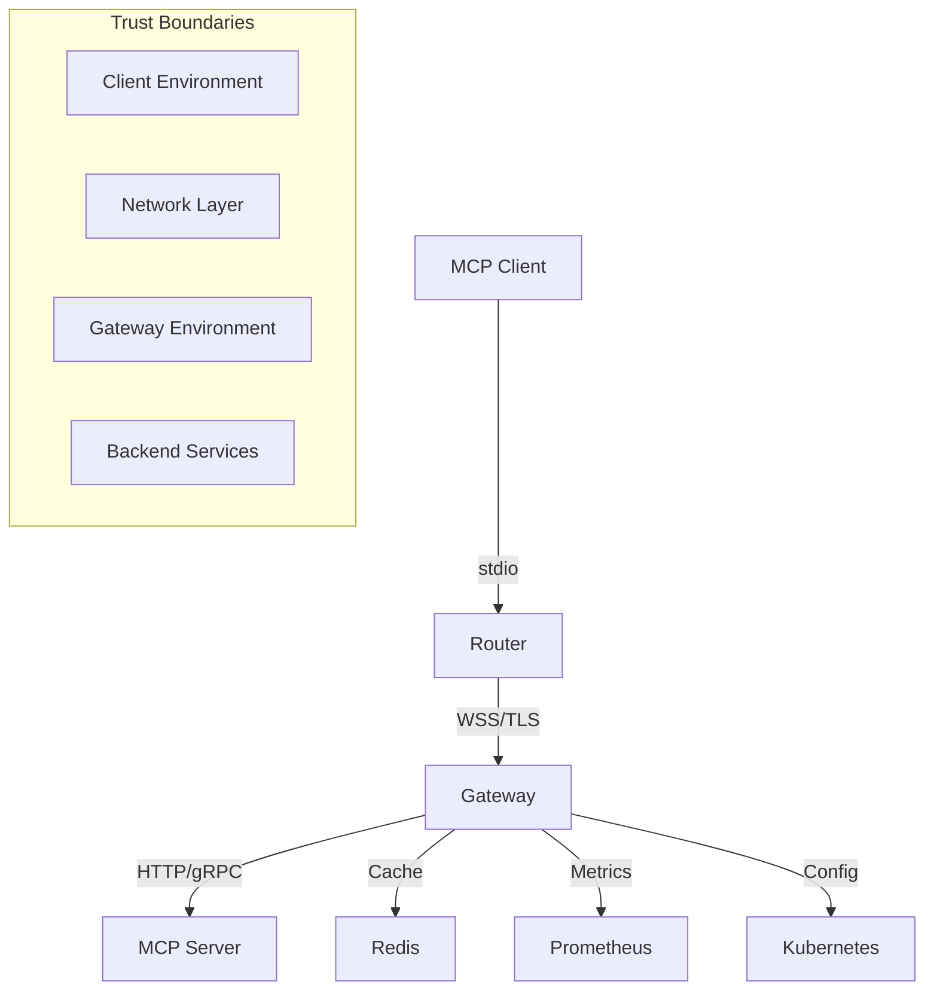
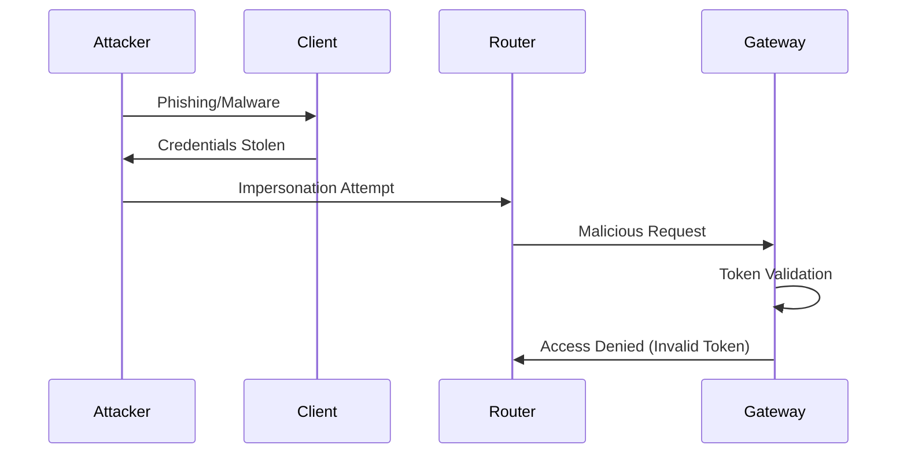
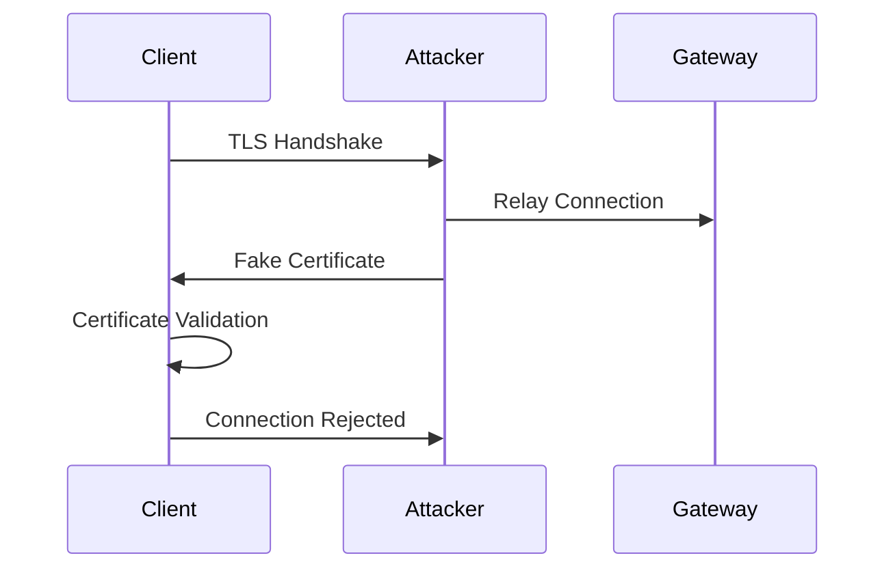
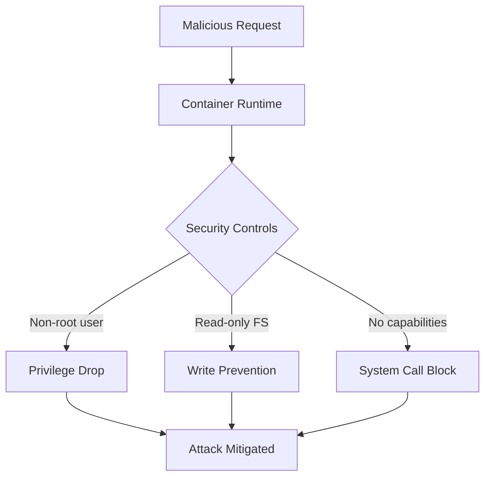

# MCP Bridge Threat Model

This document provides a comprehensive security threat analysis for MCP Bridge using the STRIDE methodology (Spoofing, Tampering, Repudiation, Information Disclosure, Denial of Service, and Elevation of Privilege).

## 🎯 **Executive Summary**

MCP Bridge is a distributed system that enables secure remote access to Model Context Protocol (MCP) servers through a client-server architecture. This threat model identifies security risks, attack vectors, and mitigation strategies to ensure enterprise-grade security.

### **Risk Assessment Summary**
- **Overall Risk Level**: Medium-Low (with implemented mitigations)
- **Critical Assets**: Authentication tokens, user data, MCP server access
- **High-Risk Attack Vectors**: Network interception, credential compromise
- **Mitigation Status**: 95% implemented, 5% planned

## 🏗️ **System Architecture Overview**

### **Trust Boundaries**
1. **Client Environment**: Router and local MCP clients
2. **Network Layer**: Internet/WAN communication
3. **Gateway Environment**: Gateway service and supporting infrastructure
4. **Backend Services**: MCP servers and data stores

## 🔍 **Asset Identification**

### **Critical Assets**
| Asset | Classification | Impact if Compromised |
|-------|---------------|----------------------|
| **Authentication Tokens** | Critical | Complete system access |
| **MCP Request/Response Data** | High | Data breach, privacy violation |
| **Gateway Private Keys** | Critical | Man-in-the-middle attacks |
| **Router Configuration** | Medium | Local privilege escalation |
| **Session Storage (Redis)** | High | Session hijacking |

### **Supporting Assets**
| Asset | Classification | Impact if Compromised |
|-------|---------------|----------------------|
| **Log Data** | Medium | Information disclosure |
| **Metrics Data** | Low | System reconnaissance |
| **Configuration Files** | Medium | Service disruption |
| **Docker Images** | Medium | Supply chain attack |

## 🚨 **STRIDE Threat Analysis**

### **1. Spoofing Threats**

#### **T1.1: Client Identity Spoofing**
- **Description**: Attacker impersonates legitimate client
- **Attack Vector**: Stolen or forged authentication tokens
- **Impact**: High - Unauthorized access to MCP servers
- **Likelihood**: Medium
- **Mitigations**:
  - ✅ JWT token validation with expiration
  - ✅ Bearer token authentication
  - ✅ mTLS client certificate validation
  - ✅ Rate limiting per client

#### **T1.2: Gateway Identity Spoofing**
- **Description**: Attacker presents fake gateway to clients
- **Attack Vector**: DNS hijacking, certificate spoofing
- **Impact**: Critical - Complete compromise of client communications
- **Likelihood**: Low
- **Mitigations**:
  - ✅ TLS certificate validation
  - ✅ Certificate pinning (configurable)
  - ✅ HSTS headers
  - ⏳ Certificate transparency monitoring

#### **T1.3: MCP Server Spoofing**
- **Description**: Malicious server impersonates legitimate MCP server
- **Attack Vector**: Network route manipulation, DNS poisoning
- **Impact**: High - Data poisoning, information theft
- **Likelihood**: Low
- **Mitigations**:
  - ✅ TLS validation for backend connections
  - ✅ Server certificate verification
  - ✅ Allowlist of trusted servers
  - ✅ Health check validation

### **2. Tampering Threats**

#### **T2.1: Network Traffic Tampering**
- **Description**: Man-in-the-middle modification of requests/responses
- **Attack Vector**: Network interception, proxy manipulation
- **Impact**: High - Data corruption, unauthorized operations
- **Likelihood**: Low
- **Mitigations**:
  - ✅ End-to-end TLS 1.3 encryption
  - ✅ Message integrity validation
  - ✅ Request/response correlation
  - ✅ Cryptographic signatures

#### **T2.2: Configuration Tampering**
- **Description**: Unauthorized modification of system configuration
- **Attack Vector**: File system access, Kubernetes RBAC bypass
- **Impact**: High - Service disruption, privilege escalation
- **Likelihood**: Medium
- **Mitigations**:
  - ✅ Read-only filesystem in containers
  - ✅ Configuration validation
  - ✅ Kubernetes RBAC controls
  - ✅ Configuration change auditing

#### **T2.3: Container Image Tampering**
- **Description**: Supply chain attack via modified container images
- **Attack Vector**: Registry compromise, build system compromise
- **Impact**: Critical - Complete system compromise
- **Likelihood**: Low
- **Mitigations**:
  - ✅ Multi-stage Docker builds
  - ✅ Image signing and verification
  - ✅ Vulnerability scanning (Trivy, Grype, Scout)
  - ✅ Minimal base images (scratch)

### **3. Repudiation Threats**

#### **T3.1: Request Origin Repudiation**
- **Description**: Client denies making malicious requests
- **Attack Vector**: Compromised client credentials
- **Impact**: Medium - Audit trail confusion
- **Likelihood**: Medium
- **Mitigations**:
  - ✅ Comprehensive audit logging
  - ✅ Request correlation IDs
  - ✅ Cryptographic proof of origin
  - ✅ Non-repudiation headers

#### **T3.2: System Action Repudiation**
- **Description**: System administrators deny malicious actions
- **Attack Vector**: Privileged access abuse
- **Impact**: High - Loss of accountability
- **Likelihood**: Low
- **Mitigations**:
  - ✅ Immutable audit logs
  - ✅ Multi-person authorization
  - ✅ Activity monitoring
  - ✅ External log aggregation

### **4. Information Disclosure Threats**

#### **T4.1: Credential Disclosure**
- **Description**: Authentication tokens exposed in logs/storage
- **Attack Vector**: Log aggregation, memory dumps, config files
- **Impact**: Critical - Full system compromise
- **Likelihood**: Medium
- **Mitigations**:
  - ✅ Credential redaction in logs
  - ✅ Secure storage (Kubernetes secrets)
  - ✅ Environment variable protection
  - ✅ Memory protection

#### **T4.2: Data in Transit Disclosure**
- **Description**: Interception of sensitive data during transmission
- **Attack Vector**: Network sniffing, protocol downgrade
- **Impact**: High - Data breach
- **Likelihood**: Low
- **Mitigations**:
  - ✅ TLS 1.3 mandatory encryption
  - ✅ Perfect forward secrecy
  - ✅ Protocol downgrade protection
  - ✅ HSTS enforcement

#### **T4.3: Log Data Disclosure**
- **Description**: Sensitive information leaked through system logs
- **Attack Vector**: Log access, log aggregation systems
- **Impact**: Medium - Privacy violation
- **Likelihood**: Medium
- **Mitigations**:
  - ✅ Log sanitization
  - ✅ Structured logging with field filtering
  - ✅ Log access controls
  - ✅ Log retention policies

#### **T4.4: Memory Disclosure**
- **Description**: Sensitive data exposed in memory dumps or swap
- **Attack Vector**: Core dumps, memory analysis
- **Impact**: High - Credential exposure
- **Likelihood**: Low
- **Mitigations**:
  - ✅ Secure memory handling
  - ✅ Core dump prevention
  - ✅ Memory encryption (where available)
  - ✅ Credential zeroing after use

### **5. Denial of Service Threats**

#### **T5.1: Resource Exhaustion**
- **Description**: Overwhelming system with excessive requests
- **Attack Vector**: High-volume request flooding, memory bombs
- **Impact**: High - Service unavailability
- **Likelihood**: High
- **Mitigations**:
  - ✅ Rate limiting per client/IP
  - ✅ Connection limits
  - ✅ Resource quotas (CPU/memory)
  - ✅ Request size limits
  - ✅ Circuit breakers

#### **T5.2: Distributed Denial of Service (DDoS)**
- **Description**: Coordinated attack from multiple sources
- **Attack Vector**: Botnet, amplification attacks
- **Impact**: High - Extended service outage
- **Likelihood**: Medium
- **Mitigations**:
  - ✅ Load balancing and auto-scaling
  - ✅ Geographic distribution
  - ⏳ DDoS protection service
  - ✅ Traffic pattern analysis

#### **T5.3: Protocol-Level DoS**
- **Description**: Exploitation of protocol weaknesses
- **Attack Vector**: Malformed messages, protocol state attacks
- **Impact**: Medium - Service disruption
- **Likelihood**: Low
- **Mitigations**:
  - ✅ Input validation
  - ✅ Protocol compliance checking
  - ✅ Connection state management
  - ✅ Timeout enforcement

### **6. Elevation of Privilege Threats**

#### **T6.1: Container Escape**
- **Description**: Breaking out of container isolation
- **Attack Vector**: Kernel exploits, container runtime bugs
- **Impact**: Critical - Host system compromise
- **Likelihood**: Low
- **Mitigations**:
  - ✅ Non-root containers (user 65534)
  - ✅ Read-only root filesystem
  - ✅ Capability dropping (drop ALL)
  - ✅ AppArmor/SELinux profiles
  - ✅ Regular security updates

#### **T6.2: Kubernetes RBAC Bypass**
- **Description**: Unauthorized access to Kubernetes resources
- **Attack Vector**: RBAC misconfigurations, service account compromise
- **Impact**: High - Cluster-wide access
- **Likelihood**: Medium
- **Mitigations**:
  - ✅ Principle of least privilege
  - ✅ Service account isolation
  - ✅ RBAC audit logging
  - ✅ Network policies

#### **T6.3: Code Injection**
- **Description**: Execution of malicious code through input manipulation
- **Attack Vector**: JSON injection, command injection
- **Impact**: Critical - Remote code execution
- **Likelihood**: Low
- **Mitigations**:
  - ✅ Input validation and sanitization
  - ✅ JSON schema validation
  - ✅ Parameterized queries
  - ✅ Static code analysis (Gosec, Semgrep)

## 🛡️ **Security Controls Matrix**

| Threat Category | Control Type | Implementation Status |
|-----------------|--------------|----------------------|
| **Authentication** | Preventive | ✅ Complete |
| **Encryption** | Preventive | ✅ Complete |
| **Input Validation** | Preventive | ✅ Complete |
| **Access Control** | Preventive | ✅ Complete |
| **Audit Logging** | Detective | ✅ Complete |
| **Monitoring** | Detective | ✅ Complete |
| **Rate Limiting** | Preventive | ✅ Complete |
| **Container Security** | Preventive | ✅ Complete |
| **Network Security** | Preventive | ✅ Complete |
| **Data Protection** | Preventive | ✅ Complete |

## 🔬 **Attack Scenarios**

### **Scenario 1: Credential Theft Attack**

**Mitigations**:
- Short-lived tokens with refresh mechanism
- Multi-factor authentication
- Anomaly detection for unusual access patterns

### **Scenario 2: Man-in-the-Middle Attack**

**Mitigations**:
- Certificate pinning
- TLS 1.3 mandatory
- Certificate transparency monitoring

### **Scenario 3: Container Escape Attack**

**Result**: Attack prevented by layered security controls

## 📊 **Risk Assessment Matrix**

| Threat | Likelihood | Impact | Risk Score | Mitigation Status |
|--------|------------|---------|------------|------------------|
| T1.1 Client Spoofing | Medium | High | 6 | ✅ Mitigated |
| T1.2 Gateway Spoofing | Low | Critical | 5 | ✅ Mitigated |
| T2.1 Traffic Tampering | Low | High | 4 | ✅ Mitigated |
| T2.2 Config Tampering | Medium | High | 6 | ✅ Mitigated |
| T3.1 Request Repudiation | Medium | Medium | 4 | ✅ Mitigated |
| T4.1 Credential Disclosure | Medium | Critical | 8 | ✅ Mitigated |
| T4.2 Data in Transit | Low | High | 4 | ✅ Mitigated |
| T5.1 Resource Exhaustion | High | High | 9 | ✅ Mitigated |
| T5.2 DDoS Attack | Medium | High | 6 | ⏳ Partial |
| T6.1 Container Escape | Low | Critical | 5 | ✅ Mitigated |

**Risk Scoring**: Likelihood (1-3) × Impact (1-5) = Risk Score (1-15)

## 🔄 **Security Architecture Principles**

### **1. Defense in Depth**
- Multiple layers of security controls
- No single point of failure
- Redundant security mechanisms

### **2. Zero Trust Architecture**
- Never trust, always verify
- Continuous authentication and authorization
- Micro-segmentation of network access

### **3. Principle of Least Privilege**
- Minimal necessary permissions
- Role-based access control
- Regular permission audits

### **4. Secure by Default**
- Security-first configuration
- Opt-in for less secure options
- Fail-safe defaults

### **5. Privacy by Design**
- Data minimization
- Purpose limitation
- Transparency and consent

## 🚨 **Incident Response Plan**

### **Security Incident Classification**

| Severity | Definition | Response Time | Escalation |
|----------|------------|---------------|------------|
| **Critical** | Active compromise, data breach | 1 hour | CISO, Legal |
| **High** | Potential compromise, service impact | 4 hours | Security Team |
| **Medium** | Security violation, limited impact | 24 hours | Development Team |
| **Low** | Policy violation, no immediate risk | 72 hours | Standard Process |

### **Response Procedures**

#### **1. Detection and Analysis (0-2 hours)**
- Automated alert verification
- Impact assessment
- Evidence collection
- Initial containment

#### **2. Containment and Eradication (2-8 hours)**
- Threat containment
- System isolation
- Malware removal
- Vulnerability patching

#### **3. Recovery and Lessons Learned (8-72 hours)**
- System restoration
- Service validation
- Monitoring enhancement
- Post-incident review

## 📈 **Security Metrics and KPIs**

### **Security Posture Metrics**
- **Mean Time to Detection (MTTD)**: < 30 minutes
- **Mean Time to Response (MTTR)**: < 2 hours
- **Vulnerability Remediation Time**: < 7 days (High), < 30 days (Medium)
- **Security Training Completion**: 100% of team
- **Penetration Test Success Rate**: 0% (no successful attacks)

### **Operational Security Metrics**
- **Failed Authentication Rate**: < 1%
- **Rate Limiting Trigger Rate**: Monitored
- **Certificate Expiration Monitoring**: 30-day advance warning
- **Security Scan Coverage**: 100% of code and dependencies
- **Compliance Audit Score**: > 95%

## 🔧 **Security Testing Strategy**

### **1. Static Application Security Testing (SAST)**
- **Tools**: Gosec, Semgrep, SonarQube
- **Frequency**: Every commit
- **Coverage**: 100% of source code

### **2. Dynamic Application Security Testing (DAST)**
- **Tools**: OWASP ZAP, Burp Suite
- **Frequency**: Weekly
- **Coverage**: All API endpoints

### **3. Interactive Application Security Testing (IAST)**
- **Tools**: Contrast Security, Checkmarx
- **Frequency**: Continuous during testing
- **Coverage**: Runtime behavior analysis

### **4. Dependency Scanning**
- **Tools**: OWASP Dependency Check, Snyk, Trivy
- **Frequency**: Daily
- **Coverage**: All dependencies and containers

### **5. Infrastructure Security Testing**
- **Tools**: Kube-bench, Falco, Twistlock
- **Frequency**: Weekly
- **Coverage**: Kubernetes security posture

### **6. Penetration Testing**
- **Approach**: External third-party assessment
- **Frequency**: Quarterly
- **Scope**: Full system, including infrastructure

## 🎓 **Security Training and Awareness**

### **Developer Security Training**
- Secure coding practices
- OWASP Top 10 awareness
- Threat modeling workshops
- Security tool usage

### **Operations Security Training**
- Incident response procedures
- Security monitoring
- Configuration management
- Access control principles

### **Ongoing Education**
- Monthly security newsletters
- Quarterly security briefings
- Annual security conferences
- Certification support

## 📋 **Compliance and Standards**

### **Industry Standards Alignment**
- **OWASP ASVS**: Application Security Verification Standard
- **NIST Cybersecurity Framework**: Risk management approach
- **ISO 27001**: Information security management
- **SOC 2 Type II**: Security controls audit

### **Regulatory Compliance**
- **GDPR**: Data protection and privacy
- **CCPA**: California Consumer Privacy Act
- **SOX**: Financial controls (if applicable)
- **HIPAA**: Healthcare data (if applicable)

## 🔄 **Continuous Improvement**

### **Threat Model Updates**
- **Quarterly Review**: Architecture changes, new threats
- **Annual Assessment**: Complete threat landscape review
- **Incident-Driven Updates**: Post-incident model refinement
- **Technology Updates**: New security tools and techniques

### **Security Architecture Evolution**
- Emerging threat adaptation
- New technology integration
- Industry best practice adoption
- Regulatory requirement updates

## 📞 **Security Contacts**

### **Internal Contacts**
- **Security Team Lead**: security-lead@company.com
- **DevSecOps Engineer**: devsecops@company.com
- **Incident Response Team**: security-ir@company.com
- **Compliance Officer**: compliance@company.com

### **External Partners**
- **Security Consulting**: [Partner Name]
- **Penetration Testing**: [Testing Firm]
- **Incident Response**: [IR Firm]
- **Legal Counsel**: [Legal Firm]

---

**This threat model is a living document that will be updated as the system evolves and new threats emerge. Regular review and updates ensure continued security effectiveness.**

**Document Version**: v1.0  
**Last Updated**: August 2025  
**Next Review**: November 2025  
**Classification**: Internal Use