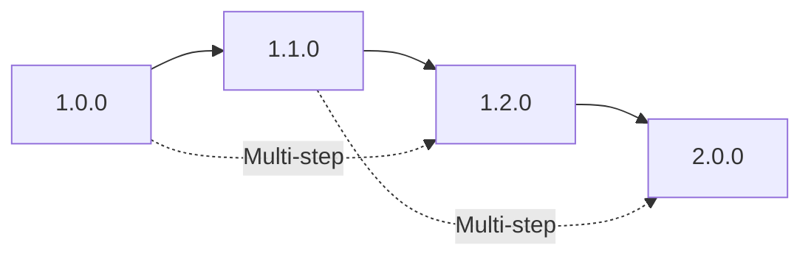

# MCP Bridge Upgrade Guide

Comprehensive guide for upgrading MCP Bridge between versions.

## Table of Contents

- [Overview](#overview)
- [Upgrade Strategy](#upgrade-strategy)
- [Pre-Upgrade Checklist](#pre-upgrade-checklist)
- [Upgrade Procedures](#upgrade-procedures)
- [Version-Specific Instructions](#version-specific-instructions)
- [Rollback Procedures](#rollback-procedures)
- [Troubleshooting](#troubleshooting)
- [Best Practices](#best-practices)

## Overview

MCP Bridge follows semantic versioning (MAJOR.MINOR.PATCH) with careful consideration for backward compatibility and smooth upgrade paths.

### Version Policy

- **Major versions** (1.0.0 → 2.0.0): May include breaking changes
- **Minor versions** (1.0.0 → 1.1.0): New features, backward compatible
- **Patch versions** (1.0.0 → 1.0.1): Bug fixes only

### Supported Upgrade Paths



## Upgrade Strategy

### Zero-Downtime Upgrades

For production environments, we recommend a blue-green deployment strategy:

1. Deploy new version alongside existing version
2. Gradually shift traffic to new version
3. Monitor for issues
4. Complete migration or rollback

### Rolling Updates (Kubernetes)

```yaml
# Deployment strategy for zero-downtime upgrades
spec:
  strategy:
    type: RollingUpdate
    rollingUpdate:
      maxSurge: 1
      maxUnavailable: 0
```

## Pre-Upgrade Checklist

Before starting any upgrade:

- [ ] **Review release notes** for the target version
- [ ] **Check compatibility matrix** for dependencies
- [ ] **Backup all data** including configurations and Redis
- [ ] **Test upgrade in staging** environment first
- [ ] **Plan maintenance window** if downtime is required
- [ ] **Verify disk space** (minimum 2GB free)
- [ ] **Document current configuration** for rollback
- [ ] **Check health of current system**
- [ ] **Notify stakeholders** of upgrade schedule

## Upgrade Procedures

### Automated Upgrade

The recommended approach using the migration tool:

```bash
# Check current version
cat VERSION

# Dry run to see what will change
./scripts/migrate.sh --dry-run 1.1.0

# Perform upgrade with automatic backup
./scripts/migrate.sh 1.1.0

# Verify upgrade
./scripts/migrate.sh --verify
```

### Manual Upgrade

For environments where automation isn't suitable:

#### Step 1: Backup Current Installation

```bash
# Create backup directory
BACKUP_DIR="backup-$(date +%Y%m%d-%H%M%S)"
mkdir -p "$BACKUP_DIR"

# Backup configurations
cp -r configs "$BACKUP_DIR/"
cp -r services/*/configs "$BACKUP_DIR/" 2>/dev/null || true

# Backup Redis data (if using Redis)
redis-cli --rdb "$BACKUP_DIR/redis-dump.rdb"

# Backup Kubernetes resources (if applicable)
kubectl get all,configmap,secret -n mcp-system -o yaml > "$BACKUP_DIR/k8s-resources.yaml"

# Create backup manifest
cat > "$BACKUP_DIR/manifest.json" << EOF
{
  "date": "$(date -u +%Y-%m-%dT%H:%M:%SZ)",
  "from_version": "$(cat VERSION)",
  "components": ["configs", "redis", "kubernetes"]
}
EOF

# Compress backup
tar -czf "${BACKUP_DIR}.tar.gz" "$BACKUP_DIR"
rm -rf "$BACKUP_DIR"
```

#### Step 2: Stop Services

```bash
# For systemd
sudo systemctl stop mcp-gateway mcp-router

# For Docker Compose
docker-compose down

# For Kubernetes
kubectl scale deployment mcp-gateway mcp-router --replicas=0 -n mcp-system
```

#### Step 3: Update Binaries

```bash
# Download new version
wget https://github.com/actual-software/mcp-bridge/releases/download/v1.1.0/mcp-bridge-v1.1.0.tar.gz
tar -xzf mcp-bridge-v1.1.0.tar.gz

# Replace binaries
cp bin/mcp-gateway services/gateway/bin/
cp bin/mcp-router services/router/bin/

# Verify versions
services/gateway/bin/mcp-gateway --version
services/router/bin/mcp-router --version
```

#### Step 4: Update Configurations

Apply configuration changes based on the version-specific instructions below.

#### Step 5: Migrate Data

```bash
# Run migration scripts
./migrations/1.0.0_to_1.1.0.sh
```

#### Step 6: Start Services

```bash
# For systemd
sudo systemctl start mcp-gateway mcp-router

# For Docker Compose
docker-compose up -d

# For Kubernetes
kubectl apply -f deployments/kubernetes/
```

#### Step 7: Verify Upgrade

```bash
# Check service health
curl http://localhost:8080/health
curl http://localhost:9091/health

# Check logs for errors
journalctl -u mcp-gateway -n 100
journalctl -u mcp-router -n 100

# Run smoke tests
./test/smoke-test.sh
```

## Version-Specific Instructions

### Upgrading to 1.1.0

**New Features:**
- Enhanced connection pooling
- Distributed tracing support (OpenTelemetry)
- TCP health check endpoint
- Improved rate limiting with sliding windows

**Configuration Changes:**

1. **Gateway Configuration** (`configs/gateway.yaml`):
```yaml
# Add new sections
rate_limit:
  advanced:
    sliding_window: true
    sync_interval: 1s
    cleanup_interval: 60s

health:
  checks:
    tcp_enabled: true
    tcp_port: 8081
    check_interval: 10s
    timeout: 5s

observability:
  tracing:
    enabled: true
    provider: otlp
    endpoint: localhost:4317
    sample_rate: 0.1
```

2. **Router Configuration** (`configs/router.yaml`):
```yaml
# Add connection pool settings
gateway_pool:
  connection_pool:
    max_idle_conns: 100
    max_open_conns: 200
    conn_max_lifetime: 5m
    health_check_interval: 30s
```

**Redis Schema Changes:**
- Session keys: `session:*` → `mcp:session:*`
- Rate limit keys: `ratelimit:*` → `mcp:ratelimit:v2:*`

Run the migration script to automatically migrate Redis data:
```bash
./migrations/1.0.0_to_1.1.0.sh
```

**Environment Variables:**
```bash
# New in 1.1.0
export OTEL_EXPORTER_OTLP_ENDPOINT=http://otel-collector:4317
export MCP_HEALTH_TCP_ENABLED=true
export MCP_HEALTH_TCP_PORT=8081
```

### Upgrading to 1.2.0

**New Features:**
- Multi-region support
- Advanced circuit breaker patterns
- Webhook notifications
- Performance improvements

**Breaking Changes:**
- Metrics renamed to follow Prometheus conventions
- Old API endpoints deprecated

**Migration Steps:**
1. Update Prometheus scrape configs
2. Migrate to new metrics names
3. Update dashboard queries

### Upgrading to 2.0.0

**Major Changes:**
- New protocol version (v2)
- GraphQL API support
- Plugin architecture
- Multi-tenancy

**Important:** Version 2.0.0 requires a multi-step migration:
```bash
# Step 1: Upgrade to latest 1.x
./scripts/migrate.sh 1.2.0

# Step 2: Run pre-2.0 compatibility check
./scripts/migrate.sh --check-compatibility 2.0.0

# Step 3: Upgrade to 2.0.0
./scripts/migrate.sh 2.0.0
```

## Rollback Procedures

### Automated Rollback

```bash
# Rollback to previous version
./scripts/migrate.sh --rollback

# Rollback to specific backup
./scripts/migrate.sh --rollback --backup backups/backup-20240120-100000.tar.gz
```

### Manual Rollback

#### Step 1: Stop Services

```bash
# Stop all services
sudo systemctl stop mcp-gateway mcp-router
# or
docker-compose down
# or
kubectl scale deployment mcp-gateway mcp-router --replicas=0 -n mcp-system
```

#### Step 2: Restore Backup

```bash
# Extract backup
tar -xzf backup-20240120-100000.tar.gz

# Restore configurations
cp -r backup-*/configs/* configs/

# Restore Redis data (if applicable)
redis-cli FLUSHALL
redis-cli --rdb-restore backup-*/redis-dump.rdb

# Restore Kubernetes resources (if applicable)
kubectl apply -f backup-*/k8s-resources.yaml
```

#### Step 3: Downgrade Binaries

```bash
# Restore previous version binaries
cp backup-*/bin/* services/*/bin/
```

#### Step 4: Start Services

```bash
# Start services with previous version
sudo systemctl start mcp-gateway mcp-router
```

## Troubleshooting

### Common Issues

#### Issue: Services fail to start after upgrade

**Solution:**
```bash
# Check configuration validation
services/gateway/bin/mcp-gateway --config configs/gateway.yaml --validate
services/router/bin/mcp-router --config configs/router.yaml --validate

# Check for port conflicts
sudo lsof -i :8080
sudo lsof -i :9091

# Review logs
journalctl -xe -u mcp-gateway
journalctl -xe -u mcp-router
```

#### Issue: Redis migration fails

**Solution:**
```bash
# Check Redis connectivity
redis-cli ping

# Manually run migration
redis-cli --eval migrations/redis/1.1.0.lua

# Verify data structure
redis-cli KEYS "mcp:*"
```

#### Issue: Kubernetes pods in CrashLoopBackOff

**Solution:**
```bash
# Check pod logs
kubectl logs -n mcp-system deployment/mcp-gateway --previous

# Describe pod for events
kubectl describe pod -n mcp-system -l app=mcp-gateway

# Check ConfigMap
kubectl get configmap -n mcp-system mcp-config -o yaml
```

### Recovery Procedures

#### Corrupted Configuration

```bash
# Restore default configuration
cp configs/gateway.yaml.default configs/gateway.yaml
cp configs/router.yaml.default configs/router.yaml

# Apply minimum required settings
cat >> configs/gateway.yaml << EOF
server:
  port: 8080
  host: 0.0.0.0
EOF
```

#### Data Loss Recovery

```bash
# Restore from latest backup
./scripts/migrate.sh --restore backups/latest.tar.gz

# Rebuild from source
git checkout v1.1.0
make build
make install
```

## Best Practices

### 1. Testing Strategy

Always test upgrades in this order:
1. **Development** environment
2. **Staging** environment (production-like)
3. **Production** (during maintenance window)

### 2. Gradual Rollout

For production upgrades:
```bash
# Upgrade 10% of instances
kubectl set image deployment/mcp-gateway gateway=mcp-gateway:1.1.0 -n mcp-system
kubectl scale deployment/mcp-gateway --replicas=1 -n mcp-system

# Monitor for 24 hours
# If stable, continue rollout
kubectl scale deployment/mcp-gateway --replicas=10 -n mcp-system
```

### 3. Monitoring During Upgrade

Key metrics to watch:
- Error rates
- Response times
- Connection pool utilization
- Memory and CPU usage
- Redis connection status

```bash
# Monitor in real-time
watch -n 1 'curl -s http://localhost:8080/health | jq .'

# Check metrics
curl http://localhost:9091/metrics | grep mcp_
```

### 4. Communication Plan

- **Before upgrade:** Notify users of maintenance window
- **During upgrade:** Update status page
- **After upgrade:** Confirm successful completion

### 5. Documentation

Keep records of:
- Upgrade date and time
- Version changes
- Configuration modifications
- Issues encountered
- Resolution steps

### 6. Automation

Use CI/CD for upgrades:
```yaml
# .github/workflows/upgrade.yml
name: Automated Upgrade
on:
  release:
    types: [published]
jobs:
  upgrade:
    runs-on: ubuntu-latest
    steps:
      - uses: actions/checkout@v2
      - name: Run upgrade
        run: |
          ./scripts/migrate.sh ${{ github.event.release.tag_name }}
      - name: Verify upgrade
        run: |
          ./test/smoke-test.sh
```

## Support

For upgrade assistance:
- GitHub Issues: https://github.com/actual-software/mcp-bridge/issues
- Documentation: https://docs.mcp-bridge.io/upgrade
- Community Forum: https://forum.mcp-bridge.io

## Appendix

### Compatibility Matrix

| MCP Version | Go Version | Redis Version | Kubernetes Version | Docker Version |
|-------------|------------|---------------|-------------------|----------------|
| 1.0.0       | 1.21+      | 6.0+          | 1.24+             | 20.10+         |
| 1.1.0       | 1.21+      | 6.2+          | 1.25+             | 20.10+         |
| 1.2.0       | 1.22+      | 7.0+          | 1.26+             | 23.0+          |
| 2.0.0       | 1.22+      | 7.2+          | 1.27+             | 24.0+          |

### Migration Script Reference

| Script | Purpose | Usage |
|--------|---------|-------|
| `migrate.sh` | Main migration tool | `./scripts/migrate.sh [OPTIONS] VERSION` |
| `1.0.0_to_1.1.0.sh` | Version-specific migration | Automatically called by migrate.sh |
| `common.sh` | Shared migration functions | Sourced by migration scripts |
| `redis-migrate.lua` | Redis data migration | Executed via redis-cli |
| `rollback.sh` | Emergency rollback | `./scripts/rollback.sh [BACKUP]` |