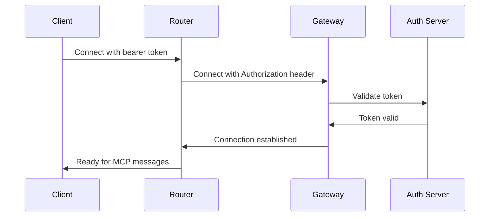
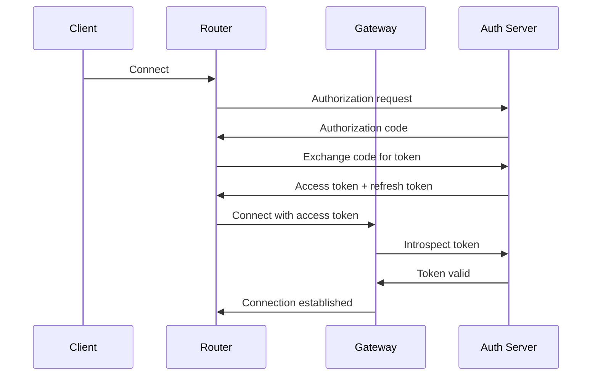

# Authentication Guide

This document covers all authentication methods supported by MCP Bridge and how to configure them.

## Overview

MCP Bridge supports multiple authentication methods to ensure secure access to MCP servers:

- **Bearer Token Authentication** - JWT and API key tokens
- **OAuth2 Authentication** - OAuth2 flows with token introspection
- **Mutual TLS (mTLS)** - Certificate-based authentication
- **Combined Authentication** - Multiple methods for enhanced security

## Bearer Token Authentication

### JWT Tokens

Configure JWT token validation:

```yaml
# Gateway configuration
auth:
  bearer:
    enabled: true
    jwt:
      secret: "your-jwt-secret-key"
      algorithm: "HS256"
      issuer: "mcp-bridge"
      audience: "mcp-clients"
      expiration_leeway: 300s
```

### API Key Tokens

Simple API key authentication:

```yaml
# Gateway configuration
auth:
  bearer:
    enabled: true
    api_keys:
      - key: "api-key-12345"
        name: "client-1"
        permissions: ["tools:*", "resources:read"]
      - key: "api-key-67890" 
        name: "client-2"
        permissions: ["tools:call", "prompts:*"]
```

### Router Configuration

```yaml
# Router configuration
gateway:
  auth:
    type: bearer
    token_store: keychain  # or file, memory
    token: "your-bearer-token"
```

### Token Storage Options

#### Keychain Storage (Recommended)
```yaml
gateway:
  auth:
    type: bearer
    token_store: keychain
    keychain:
      service: "mcp-bridge"
      account: "gateway-token"
```

#### File Storage
```yaml
gateway:
  auth:
    type: bearer
    token_store: file
    file:
      path: "~/.config/mcp-router/token"
      permissions: 0600
```

#### Environment Variable
```yaml
gateway:
  auth:
    type: bearer
    token_store: env
    env_var: "MCP_AUTH_TOKEN"
```

## OAuth2 Authentication

### OAuth2 Configuration

```yaml
# Gateway configuration
auth:
  oauth2:
    enabled: true
    provider:
      issuer_url: "https://auth.example.com"
      client_id: "mcp-bridge-gateway"
      client_secret: "gateway-secret"
    introspection:
      endpoint: "https://auth.example.com/introspect"
      cache_ttl: 300s
    required_scopes:
      - "mcp:access"
      - "tools:execute"
```

### Supported OAuth2 Flows

#### Authorization Code Flow
```yaml
# Router configuration  
gateway:
  auth:
    type: oauth2
    oauth2:
      flow: authorization_code
      client_id: "mcp-bridge-router"
      client_secret: "router-secret"
      authorization_url: "https://auth.example.com/authorize"
      token_url: "https://auth.example.com/token"
      scopes: ["mcp:access", "offline_access"]
      redirect_url: "http://localhost:8080/callback"
```

#### Client Credentials Flow
```yaml
# Router configuration
gateway:
  auth:
    type: oauth2
    oauth2:
      flow: client_credentials
      client_id: "mcp-bridge-service"
      client_secret: "service-secret"
      token_url: "https://auth.example.com/token"
      scopes: ["mcp:service"]
```

### Token Refresh

Automatic token refresh is supported:

```yaml
oauth2:
  token_refresh:
    enabled: true
    refresh_threshold: 300s  # Refresh 5 minutes before expiry
    retry_attempts: 3
    retry_delay: 5s
```

## Mutual TLS (mTLS) Authentication

### Certificate Configuration

```yaml
# Gateway configuration
auth:
  mtls:
    enabled: true
    ca_cert: "/path/to/ca.crt"
    cert_file: "/path/to/server.crt"
    key_file: "/path/to/server.key"
    client_auth_type: "require_and_verify"
    
# Router configuration  
gateway:
  auth:
    type: mtls
    mtls:
      cert_file: "/path/to/client.crt"
      key_file: "/path/to/client.key"
      ca_cert: "/path/to/ca.crt"
      insecure_skip_verify: false
```

### Certificate Management

#### Automatic Certificate Renewal
```yaml
mtls:
  cert_manager:
    enabled: true
    renewal_threshold: "720h"  # 30 days
    backup_certs: true
```

#### Certificate Validation
```yaml
mtls:
  validation:
    verify_client_cert: true
    allowed_dns_names:
      - "*.clients.example.com"
    allowed_organizations:
      - "MCP Bridge Clients"
    check_certificate_revocation: true
```

## Combined Authentication

Use multiple authentication methods simultaneously:

```yaml
# Gateway configuration
auth:
  combined:
    enabled: true
    methods:
      - bearer
      - mtls
    require_all: false  # OR logic
    # require_all: true # AND logic
```

## Per-Route Authentication

Configure different authentication for different routes:

```yaml
# Gateway configuration
routes:
  - path: "/public/*"
    auth: none
    
  - path: "/api/tools/*"
    auth:
      methods: [bearer]
      required_scopes: ["tools:execute"]
      
  - path: "/api/admin/*"
    auth:
      methods: [bearer, mtls]
      require_all: true
      required_permissions: ["admin:*"]
```

## Authentication Flow

### Bearer Token Flow



### OAuth2 Flow



## Token Management

### Token Rotation

```yaml
token_rotation:
  enabled: true
  rotation_interval: "24h"
  overlap_period: "1h"
  notification_webhook: "https://monitoring.example.com/webhook"
```

### Token Revocation

```yaml
token_revocation:
  enabled: true
  check_interval: "300s"
  revocation_list_url: "https://auth.example.com/revoked"
  cache_duration: "3600s"
```

## Authorization

### Role-Based Access Control (RBAC)

```yaml
# Gateway configuration
authorization:
  rbac:
    enabled: true
    roles:
      admin:
        permissions:
          - "tools:*"
          - "resources:*"
          - "prompts:*"
          - "admin:*"
      user:
        permissions:
          - "tools:call"
          - "resources:read"
          - "prompts:get"
      readonly:
        permissions:
          - "tools:list"
          - "resources:list"
          - "prompts:list"
```

### Attribute-Based Access Control (ABAC)

```yaml
authorization:
  abac:
    enabled: true
    policies:
      - name: "time_based_access"
        condition: "time.hour >= 9 && time.hour <= 17"
        effect: "allow"
        
      - name: "ip_whitelist"
        condition: "request.ip in ['192.168.1.0/24', '10.0.0.0/8']"
        effect: "allow"
        
      - name: "resource_owner"
        condition: "resource.owner == user.id"
        effect: "allow"
```

## Security Best Practices

### Token Security

1. **Use strong secrets** for JWT signing
2. **Rotate tokens regularly** 
3. **Implement token expiration**
4. **Store tokens securely** (keychain/secure storage)
5. **Use HTTPS only** for token transmission

### Certificate Security

1. **Use strong key sizes** (RSA 2048+ or ECDSA P-256+)
2. **Implement certificate rotation**
3. **Monitor certificate expiration**
4. **Use proper certificate chains**
5. **Enable OCSP stapling**

### Network Security

1. **Use TLS 1.3** for all connections
2. **Implement proper certificate validation**
3. **Use secure cipher suites only**
4. **Enable Perfect Forward Secrecy**
5. **Implement rate limiting**

## Troubleshooting

### Common Issues

#### Authentication Failed
```bash
# Check token validity
curl -H "Authorization: Bearer $TOKEN" https://gateway/health

# Verify certificate
openssl x509 -in client.crt -text -noout

# Test OAuth2 flow
mcp-router auth test --provider oauth2
```

#### Token Expired
```bash
# Check token expiration
jwt decode $TOKEN

# Force token refresh
mcp-router auth refresh
```

#### Certificate Issues
```bash
# Verify certificate chain
openssl verify -CAfile ca.crt client.crt

# Check certificate expiration
openssl x509 -in client.crt -dates -noout
```

### Debug Logging

Enable authentication debugging:

```yaml
logging:
  level: debug
  auth_debug: true
```

### Health Checks

Authentication health endpoints:

- **Gateway**: `GET /auth/health`
- **Router**: Built-in auth status monitoring

## Monitoring

### Authentication Metrics

Key metrics to monitor:

- Authentication success/failure rates
- Token expiration events
- Certificate renewal status
- OAuth2 token refresh events
- Authentication latency

### Alerts

Set up alerts for:

- High authentication failure rates
- Certificate expiration warnings
- Token refresh failures
- Unusual authentication patterns

## Testing

### Authentication Tests

```bash
# Test bearer token auth
make test-auth-bearer

# Test OAuth2 flow
make test-auth-oauth2

# Test mTLS authentication
make test-auth-mtls

# Test combined authentication
make test-auth-combined
```

## Related Documentation

- [Security Implementation](SECURITY.md)
- [TLS Configuration](tls.md)
- [Configuration Reference](configuration.md)
- [Troubleshooting Guide](troubleshooting.md)