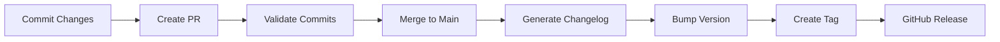

# Changelog and Release Management Guide

## Overview

MCP Bridge uses automated changelog generation based on [Conventional Commits](https://www.conventionalcommits.org/) specification. This ensures consistent commit messages and enables automatic version bumping and changelog generation.

## Table of Contents

1. [Conventional Commits](#conventional-commits)
2. [Automated Changelog](#automated-changelog)
3. [Release Process](#release-process)
4. [GitHub Actions](#github-actions)
5. [Local Tools](#local-tools)
6. [Best Practices](#best-practices)

## Conventional Commits

### Commit Message Format

All commit messages must follow this format:

```
<type>[optional scope]: <description>

[optional body]

[optional footer(s)]
```

### Commit Types

| Type | Description | Version Bump | Changelog Section |
|------|-------------|--------------|-------------------|
| `feat` | New feature | Minor | ✨ Features |
| `fix` | Bug fix | Patch | 🐛 Bug Fixes |
| `docs` | Documentation changes | None | 📚 Documentation |
| `style` | Code style changes | None | 💎 Styles |
| `refactor` | Code refactoring | None | 📦 Code Refactoring |
| `perf` | Performance improvements | Patch | 🚀 Performance |
| `test` | Test changes | None | 🚨 Tests |
| `build` | Build system changes | None | 🛠 Build System |
| `ci` | CI/CD changes | None | ⚙️ CI |
| `chore` | Other changes | None | ♻️ Chores |
| `revert` | Revert previous commit | Patch | 🗑 Reverts |

### Examples

#### Feature
```bash
git commit -m "feat(gateway): add WebSocket compression support"
```

#### Bug Fix
```bash
git commit -m "fix(router): resolve memory leak in connection pool"
```

#### Breaking Change
```bash
git commit -m "feat(api)!: change authentication token format

BREAKING CHANGE: JWT tokens now require 'Bearer' prefix"
```

#### With Scope
```bash
git commit -m "docs(security): update TLS configuration guide"
```

## Automated Changelog

### How It Works

1. **Commit Validation**: PR commits are validated against conventional commit format
2. **Automatic Generation**: Changelog updates on merge to main
3. **Version Detection**: Automatic version bump based on commit types
4. **Release Notes**: Generated from commit messages

### Version Bumping Rules

- **Major** (x.0.0): Breaking changes (`feat!:` or `BREAKING CHANGE:`)
- **Minor** (0.x.0): New features (`feat:`)
- **Patch** (0.0.x): Bug fixes (`fix:`) or performance improvements (`perf:`)

## Release Process

### Automatic Release

1. **Merge to Main**: Triggers changelog generation
2. **Version Bump**: Automatic based on commits
3. **Tag Creation**: Git tag created automatically
4. **GitHub Release**: Created with release notes

### Manual Release

```bash
# Create release with auto-detected version
./scripts/changelog.sh release

# Create release with specific version
./scripts/changelog.sh release -v 1.2.3

# Dry run to preview
./scripts/changelog.sh release --dry-run
```

### Release Workflow



## GitHub Actions

### Workflows

#### 1. Changelog Management (`changelog.yml`)

**Triggers:**
- Push to main/develop
- Pull requests
- Manual dispatch

**Features:**
- Commit message validation
- Automatic changelog generation
- PR changelog preview
- Release automation

#### 2. Triggering a Release

```yaml
# Manual trigger from GitHub UI
workflow_dispatch:
  inputs:
    version:
      description: 'Version to release'
      required: false
```

### PR Comments

The workflow automatically comments on PRs with:
- List of commits
- Change summary
- Breaking change warnings

## Local Tools

### Changelog Script

```bash
# Install the script
chmod +x scripts/changelog.sh

# Show usage
./scripts/changelog.sh --help
```

### Commands

#### Generate Changelog
```bash
# Generate from all commits
./scripts/changelog.sh generate

# Generate from specific tag
./scripts/changelog.sh generate --from v1.0.0

# Generate between tags
./scripts/changelog.sh generate --from v1.0.0 --to v1.1.0
```

#### Validate Commits
```bash
# Validate recent commits
./scripts/changelog.sh validate

# Validate specific range
./scripts/changelog.sh validate HEAD~10 HEAD
```

#### Preview Next Release
```bash
# Preview changelog for next release
./scripts/changelog.sh preview
```

#### Version Management
```bash
# Show current version
./scripts/changelog.sh version

# Bump patch version
./scripts/changelog.sh version patch

# Bump minor version
./scripts/changelog.sh version minor

# Bump major version
./scripts/changelog.sh version major
```

### Makefile Integration

```bash
# Generate changelog
make changelog

# Create release
make release

# Validate commits
make validate-commits
```

## Best Practices

### 1. Commit Messages

✅ **Good Examples:**
```bash
feat(auth): implement OAuth2 refresh token rotation
fix(gateway): handle connection timeout gracefully
docs: add troubleshooting guide for TLS errors
perf(router): optimize message parsing with buffer pooling
```

❌ **Bad Examples:**
```bash
Fixed bug              # Missing type and description
feat: stuff           # Vague description
FEAT: new feature     # Wrong case
added feature         # Missing type prefix
```

### 2. Breaking Changes

Always clearly mark breaking changes:

```bash
# Using ! notation
feat(api)!: restructure response format

# Using footer
feat(api): restructure response format

BREAKING CHANGE: Response now uses camelCase instead of snake_case
```

### 3. Scopes

Use consistent scopes:
- `gateway` - Gateway service
- `router` - Router service
- `auth` - Authentication
- `api` - API changes
- `config` - Configuration
- `docs` - Documentation
- `deps` - Dependencies
- `ci` - CI/CD

### 4. Multi-line Commits

```bash
git commit -m "feat(gateway): add request retry mechanism

Implements exponential backoff retry for failed requests
with configurable max attempts and timeout.

Closes #123"
```

### 5. Referencing Issues

```bash
# In commit message
fix(router): resolve connection leak (#456)

# In commit body
feat(auth): add API key authentication

Implements API key authentication as an alternative
to JWT tokens for service-to-service communication.

Fixes #789
Closes #790
```

## Configuration Files

### `.commitlintrc.json`

Configures commit message validation rules.

### `.versionrc.json`

Configures version bumping and changelog generation.

### `VERSION`

Contains the current project version.

## Pre-commit Hooks

### Setup

```bash
# Install pre-commit
pip install pre-commit

# Install hooks
pre-commit install --hook-type commit-msg
```

### Configuration

Add to `.pre-commit-config.yaml`:

```yaml
repos:
  - repo: https://github.com/alessandrojcm/commitlint-pre-commit-hook
    rev: v9.8.0
    hooks:
      - id: commitlint
        stages: [commit-msg]
```

## Troubleshooting

### Invalid Commit Messages

If commits don't follow the convention:

```bash
# Amend last commit
git commit --amend

# Interactive rebase to fix multiple commits
git rebase -i HEAD~3
```

### Changelog Not Updating

1. Check GitHub Actions logs
2. Verify commit format:
   ```bash
   ./scripts/changelog.sh validate
   ```
3. Manually trigger:
   ```bash
   ./scripts/changelog.sh generate
   ```

### Version Conflicts

If version conflicts occur:

```bash
# Reset version file
echo "1.0.0" > VERSION

# Regenerate changelog
./scripts/changelog.sh generate
```

## Examples

### Sample Changelog Entry

```markdown
## [1.2.0] - 2024-01-15

### ✨ Features
- add WebSocket compression support (abc123)
- implement rate limiting for API endpoints (def456)

### 🐛 Bug Fixes
- resolve memory leak in connection pool (ghi789)
- fix TLS handshake timeout issue (jkl012)

### 📚 Documentation
- update API documentation with new endpoints (mno345)
- add troubleshooting guide for common errors (pqr678)

### 🚀 Performance Improvements
- optimize message parsing with buffer pooling (stu901)
```

### Release Notes Template

```markdown
# Release v1.2.0

**Release Date:** 2024-01-15

## Highlights

This release includes WebSocket compression support, improved rate limiting, and several bug fixes.

## What's Changed

### New Features
- WebSocket compression reduces bandwidth usage by up to 70%
- Configurable rate limiting per client and endpoint

### Bug Fixes
- Fixed memory leak affecting long-running connections
- Resolved TLS handshake timeouts under high load

### Breaking Changes
- None

## Contributors
- @user1
- @user2

**Full Changelog**: https://github.com/poiley/mcp-bridge/compare/v1.1.0...v1.2.0
```

## Integration with CI/CD

### Auto-deploy on Release

```yaml
on:
  release:
    types: [published]

jobs:
  deploy:
    runs-on: ubuntu-latest
    steps:
      - name: Deploy to production
        run: |
          echo "Deploying version ${{ github.event.release.tag_name }}"
```

### Changelog in Docker Images

```dockerfile
# Include changelog in image
COPY CHANGELOG.md /app/
COPY VERSION /app/
```

## References

- [Conventional Commits](https://www.conventionalcommits.org/)
- [Semantic Versioning](https://semver.org/)
- [Keep a Changelog](https://keepachangelog.com/)
- [Commitlint](https://commitlint.js.org/)
- [Standard Version](https://github.com/conventional-changelog/standard-version)