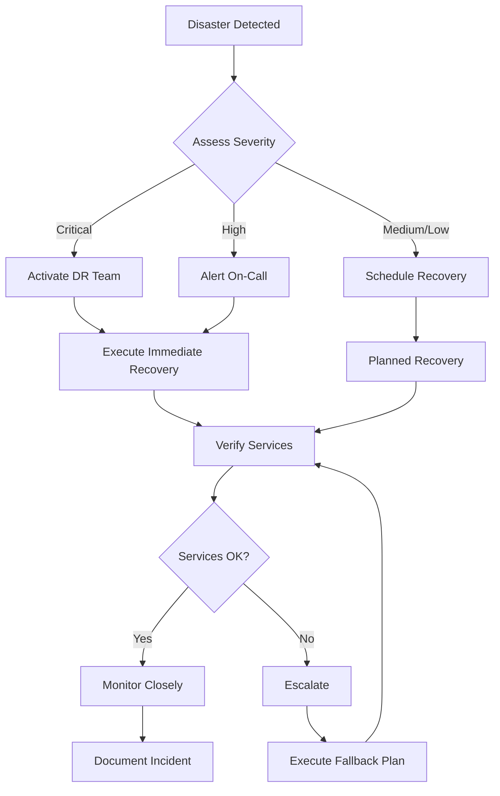

# Disaster Recovery Plan

Comprehensive disaster recovery procedures for MCP Bridge production deployments.

## Table of Contents

- [Overview](#overview)
- [Recovery Objectives](#recovery-objectives)
- [Disaster Scenarios](#disaster-scenarios)
- [Backup Strategy](#backup-strategy)
- [Recovery Procedures](#recovery-procedures)
- [Testing Plan](#testing-plan)
- [Communication Plan](#communication-plan)
- [Post-Recovery](#post-recovery)

## Overview

This document outlines procedures for recovering MCP Bridge services from various disaster scenarios, ensuring minimal downtime and data loss.

### Key Components

| Component | Priority | Recovery Method | Data Loss Risk |
|-----------|----------|-----------------|----------------|
| Gateway Service | Critical | Auto-failover / Manual rebuild | None (stateless) |
| Router Service | Critical | Client reconnect | None (stateless) |
| Redis Session Store | High | Replication / Backup restore | < 1 minute |
| Configuration | High | Git / Backup restore | None |
| TLS Certificates | High | Backup / Re-issue | None |
| Metrics Data | Medium | Backup restore | Acceptable |
| Logs | Low | Best effort restore | Acceptable |

## Recovery Objectives

### Recovery Time Objective (RTO)

| Severity | Target RTO | Service Level |
|----------|------------|---------------|
| Critical | < 15 minutes | Core services operational |
| High | < 1 hour | Full service restoration |
| Medium | < 4 hours | All features restored |
| Low | < 24 hours | Complete recovery |

### Recovery Point Objective (RPO)

| Data Type | Target RPO | Backup Frequency |
|-----------|------------|------------------|
| Configuration | 0 minutes | Git + Real-time sync |
| Session Data | 1 minute | Redis AOF persistence |
| Metrics | 1 hour | Hourly snapshots |
| Logs | 24 hours | Daily archives |

## Disaster Scenarios

### Scenario 1: Service Failure

**Description**: One or more MCP services crash or become unresponsive

**Detection**:
```bash
# Health check alerts
curl -f http://gateway:8080/health || alert
curl -f http://router:9091/health || alert
```

**Recovery Steps**:
1. **Immediate Response** (< 5 min)
   ```bash
   # Check service status
   kubectl get pods -n mcp-system
   systemctl status mcp-gateway mcp-router
   
   # Restart failed services
   kubectl rollout restart deployment/mcp-gateway -n mcp-system
   systemctl restart mcp-gateway
   ```

2. **If restart fails** (5-15 min)
   ```bash
   # Roll back to previous version
   kubectl rollout undo deployment/mcp-gateway -n mcp-system
   
   # Or restore from backup
   ./scripts/rollback.sh --auto
   ```

### Scenario 2: Data Center Failure

**Description**: Complete loss of primary data center

**Recovery Steps**:

1. **Activate DR Site** (< 15 min)
   ```bash
   # Switch DNS to DR site
   ./scripts/dr-failover.sh --site=dr-west
   
   # Verify DR services
   ./scripts/health-check.sh --site=dr-west
   ```

2. **Restore Data** (15-60 min)
   ```bash
   # Restore Redis from replica
   redis-cli --cluster failover
   
   # Sync configuration
   git pull origin main
   kubectl apply -f configs/dr-site/
   ```

### Scenario 3: Data Corruption

**Description**: Corrupted configuration or session data

**Recovery Steps**:

1. **Isolate Problem** (< 5 min)
   ```bash
   # Stop affected services
   ./scripts/stop.sh
   
   # Create forensic backup
   tar -czf corruption-backup-$(date +%s).tar.gz /var/lib/mcp-bridge/
   ```

2. **Restore Clean Data** (5-30 min)
   ```bash
   # Restore configuration from Git
   git checkout HEAD~1 configs/
   
   # Restore Redis from backup
   redis-cli FLUSHALL
   redis-cli --rdb /backups/redis-latest.rdb
   
   # Restart services
   ./scripts/start.sh
   ```

### Scenario 4: Security Breach

**Description**: Compromised credentials or unauthorized access

**Recovery Steps**:

1. **Immediate Isolation** (< 2 min)
   ```bash
   # Revoke all tokens
   redis-cli FLUSHDB
   
   # Rotate credentials
   ./scripts/rotate-credentials.sh --all --force
   
   # Block suspicious IPs
   iptables -A INPUT -s $SUSPICIOUS_IP -j DROP
   ```

2. **Service Recovery** (10-30 min)
   ```bash
   # Deploy with new credentials
   kubectl create secret generic mcp-credentials \
     --from-literal=token=$(openssl rand -hex 32)
   
   # Restart all services
   kubectl rollout restart deployment --all -n mcp-system
   ```

### Scenario 5: Complete Infrastructure Loss

**Description**: Total loss of infrastructure (Kubernetes cluster, VMs)

**Recovery Steps**:

1. **Provision New Infrastructure** (30-60 min)
   ```bash
   # Using Terraform
   cd infrastructure/
   terraform init
   terraform apply -auto-approve -var="environment=dr"
   ```

2. **Deploy Services** (15-30 min)
   ```bash
   # Deploy Kubernetes manifests
   kubectl create namespace mcp-system
   kubectl apply -f deployments/kubernetes/
   
   # Or use Helm
   helm install mcp-bridge ./deployment/helm/mcp-bridge \
     -f helm/values-disaster-recovery.yaml
   ```

3. **Restore Data** (15-30 min)
   ```bash
   # Restore configurations
   kubectl create configmap mcp-config \
     --from-file=configs/
   
   # Restore Redis data
   kubectl exec -it redis-0 -- redis-cli --rdb /restore/redis.rdb
   ```

## Backup Strategy

### Automated Backups

**Backup Script** (`scripts/backup.sh`):
```bash
#!/bin/bash
set -euo pipefail

BACKUP_ROOT="/backups/mcp-bridge"
TIMESTAMP=$(date +%Y%m%d-%H%M%S)
BACKUP_DIR="$BACKUP_ROOT/$TIMESTAMP"

# Create backup directory
mkdir -p "$BACKUP_DIR"

# 1. Backup configurations
echo "Backing up configurations..."
cp -r /etc/mcp-bridge "$BACKUP_DIR/configs"
kubectl get configmap -n mcp-system -o yaml > "$BACKUP_DIR/k8s-configmaps.yaml"

# 2. Backup Redis data
echo "Backing up Redis..."
redis-cli BGSAVE
sleep 5
cp /var/lib/redis/dump.rdb "$BACKUP_DIR/redis.rdb"

# 3. Backup TLS certificates
echo "Backing up certificates..."
cp -r /etc/mcp-bridge/certs "$BACKUP_DIR/certs"

# 4. Export Kubernetes resources
echo "Backing up Kubernetes resources..."
kubectl get all,pvc,secrets -n mcp-system -o yaml > "$BACKUP_DIR/k8s-resources.yaml"

# 5. Create backup manifest
cat > "$BACKUP_DIR/manifest.json" << EOF
{
  "timestamp": "$TIMESTAMP",
  "version": "$(cat /etc/mcp-bridge/VERSION)",
  "components": ["configs", "redis", "certs", "kubernetes"],
  "size": "$(du -sh $BACKUP_DIR | cut -f1)"
}
EOF

# 6. Compress and encrypt
echo "Compressing backup..."
tar -czf "$BACKUP_ROOT/$TIMESTAMP.tar.gz" -C "$BACKUP_ROOT" "$TIMESTAMP"
openssl enc -aes-256-cbc -in "$BACKUP_ROOT/$TIMESTAMP.tar.gz" \
  -out "$BACKUP_ROOT/$TIMESTAMP.tar.gz.enc" -k "$BACKUP_PASSWORD"

# 7. Upload to offsite storage
echo "Uploading to S3..."
aws s3 cp "$BACKUP_ROOT/$TIMESTAMP.tar.gz.enc" \
  s3://mcp-backups/daily/$TIMESTAMP.tar.gz.enc

# 8. Cleanup old backups (keep 30 days)
find "$BACKUP_ROOT" -name "*.tar.gz*" -mtime +30 -delete

echo "Backup completed: $TIMESTAMP"
```

### Backup Schedule

```yaml
# kubernetes/cronjob-backup.yaml
apiVersion: batch/v1
kind: CronJob
metadata:
  name: mcp-backup
  namespace: mcp-system
spec:
  schedule: "0 */6 * * *"  # Every 6 hours
  jobTemplate:
    spec:
      template:
        spec:
          containers:
          - name: backup
            image: mcp-bridge/backup:latest
            command: ["/scripts/backup.sh"]
            env:
            - name: BACKUP_PASSWORD
              valueFrom:
                secretKeyRef:
                  name: backup-credentials
                  key: password
            volumeMounts:
            - name: backup-storage
              mountPath: /backups
          volumes:
          - name: backup-storage
            persistentVolumeClaim:
              claimName: backup-pvc
          restartPolicy: OnFailure
```

## Recovery Procedures

### Standard Recovery Process



### Recovery Automation

**Master Recovery Script** (`scripts/disaster-recovery.sh`):
```bash
#!/bin/bash
set -euo pipefail

# Disaster Recovery Master Script
RECOVERY_MODE=${1:-auto}
BACKUP_ID=${2:-latest}

log() { echo "[$(date +'%Y-%m-%d %H:%M:%S')] $*" | tee -a /var/log/dr-recovery.log; }
error() { log "ERROR: $*" >&2; exit 1; }

# 1. Assessment Phase
log "Starting disaster recovery in $RECOVERY_MODE mode..."

# Check current state
GATEWAY_HEALTH=$(curl -s -o /dev/null -w "%{http_code}" http://gateway:8080/health || echo "000")
ROUTER_HEALTH=$(curl -s -o /dev/null -w "%{http_code}" http://router:9091/health || echo "000")
REDIS_STATUS=$(redis-cli ping 2>/dev/null || echo "FAIL")

log "Current state: Gateway=$GATEWAY_HEALTH, Router=$ROUTER_HEALTH, Redis=$REDIS_STATUS"

# 2. Determine recovery strategy
if [[ "$GATEWAY_HEALTH" == "200" ]] && [[ "$ROUTER_HEALTH" == "200" ]]; then
    log "Services appear healthy. Checking for data issues..."
    RECOVERY_TYPE="data"
elif [[ "$REDIS_STATUS" == "FAIL" ]]; then
    log "Redis failure detected. Initiating data recovery..."
    RECOVERY_TYPE="redis"
else
    log "Service failure detected. Initiating full recovery..."
    RECOVERY_TYPE="full"
fi

# 3. Execute recovery
case "$RECOVERY_TYPE" in
    data)
        log "Restoring data from backup $BACKUP_ID..."
        ./scripts/restore-data.sh --backup="$BACKUP_ID"
        ;;
    redis)
        log "Recovering Redis..."
        ./scripts/restore-redis.sh --backup="$BACKUP_ID"
        ;;
    full)
        log "Performing full system recovery..."
        ./scripts/stop.sh --force
        ./scripts/restore-full.sh --backup="$BACKUP_ID"
        ./scripts/start.sh
        ;;
esac

# 4. Verification
log "Verifying recovery..."
sleep 10

MAX_ATTEMPTS=30
ATTEMPT=0
while [[ $ATTEMPT -lt $MAX_ATTEMPTS ]]; do
    GATEWAY_OK=$(curl -s http://gateway:8080/health | jq -r '.healthy' || echo "false")
    ROUTER_OK=$(curl -s http://router:9091/health | jq -r '.status' | grep -q "healthy" && echo "true" || echo "false")
    
    if [[ "$GATEWAY_OK" == "true" ]] && [[ "$ROUTER_OK" == "true" ]]; then
        log "Recovery successful! Services are healthy."
        break
    fi
    
    ATTEMPT=$((ATTEMPT + 1))
    log "Waiting for services to become healthy... (attempt $ATTEMPT/$MAX_ATTEMPTS)"
    sleep 10
done

if [[ $ATTEMPT -eq $MAX_ATTEMPTS ]]; then
    error "Recovery failed - services did not become healthy"
fi

# 5. Post-recovery validation
log "Running post-recovery tests..."
./scripts/test-production.sh --quick

log "Disaster recovery completed successfully"

# 6. Send notification
curl -X POST "$SLACK_WEBHOOK_URL" \
  -H 'Content-Type: application/json' \
  -d "{\"text\":\"✅ Disaster recovery completed successfully. Recovery type: $RECOVERY_TYPE\"}"
```

## Testing Plan

### DR Test Schedule

| Test Type | Frequency | Duration | Impact |
|-----------|-----------|----------|--------|
| Backup Verification | Daily | 5 min | None |
| Service Restart | Weekly | 15 min | Minimal |
| Failover Test | Monthly | 1 hour | Moderate |
| Full DR Drill | Quarterly | 4 hours | Significant |

### DR Test Procedures

```bash
# scripts/dr-test.sh
#!/bin/bash

# Disaster Recovery Test Script
TEST_TYPE=${1:-basic}

case "$TEST_TYPE" in
    basic)
        echo "Testing backup/restore..."
        ./scripts/backup.sh
        ./scripts/verify-backup.sh --latest
        ;;
    
    failover)
        echo "Testing failover to DR site..."
        ./scripts/simulate-failure.sh --component=primary-site
        ./scripts/dr-failover.sh --site=dr-west
        ./scripts/verify-dr-site.sh
        ./scripts/dr-failback.sh --site=primary
        ;;
    
    full)
        echo "Full DR drill..."
        # Create test namespace
        kubectl create namespace mcp-dr-test
        
        # Deploy to test namespace
        helm install mcp-dr-test ./deployment/helm/mcp-bridge \
          --namespace mcp-dr-test \
          -f helm/values-dr-test.yaml
        
        # Simulate disaster
        kubectl delete namespace mcp-dr-test
        
        # Recover
        ./scripts/disaster-recovery.sh auto
        
        # Verify with production tests
        make -f Makefile.test test-docker
        
        # Or verify specific namespace
        ./scripts/test-production.sh --namespace=mcp-dr-test
        ;;
esac
```

## Communication Plan

### Incident Communication Matrix

| Severity | Internal | External | Leadership | Customers |
|----------|----------|----------|------------|-----------|
| Critical | Immediate | 15 min | 30 min | 1 hour |
| High | 15 min | 1 hour | 2 hours | 4 hours |
| Medium | 1 hour | 4 hours | Daily | As needed |
| Low | Daily | Weekly | Weekly | Not required |

### Communication Templates

**Initial Alert**:
```
INCIDENT ALERT - MCP Bridge Service Disruption

Severity: [CRITICAL/HIGH/MEDIUM/LOW]
Start Time: [TIMESTAMP]
Affected Services: [Gateway/Router/Redis]
Customer Impact: [None/Minimal/Moderate/Severe]

Current Status: Investigating
Next Update: In 15 minutes

Incident Commander: [NAME]
Bridge: [CONFERENCE_BRIDGE_URL]
```

**Recovery Complete**:
```
INCIDENT RESOLVED - MCP Bridge Service Restored

Duration: [DURATION]
Root Cause: [BRIEF_DESCRIPTION]
Data Loss: [None/Description]
Action Items: [Link to postmortem]

All services have been restored and verified.
```

## Post-Recovery

### Immediate Actions (First 24 Hours)

1. **Service Monitoring**
   ```bash
   # Enhanced monitoring
   ./scripts/monitor-enhanced.sh --duration=24h
   ```

2. **Data Validation**
   ```bash
   # Verify data integrity
   ./scripts/verify-data-integrity.sh
   ```

3. **Performance Testing**
   ```bash
   # Load test to verify capacity
   ./scripts/load-test.sh --profile=post-recovery
   ```

### Post-Incident Review

**Timeline**:
- T+24h: Initial incident review
- T+48h: Root cause analysis
- T+72h: Postmortem draft
- T+1w: Postmortem publication
- T+2w: Action items assigned
- T+4w: Follow-up on improvements

**Postmortem Template**:
```markdown
# Incident Postmortem: [INCIDENT_ID]

## Summary
- **Date**: [DATE]
- **Duration**: [DURATION]
- **Severity**: [SEVERITY]
- **Customer Impact**: [IMPACT]

## Timeline
[Detailed timeline of events]

## Root Cause
[Technical root cause analysis]

## Contributing Factors
- [Factor 1]
- [Factor 2]

## What Went Well
- [Success 1]
- [Success 2]

## What Could Be Improved
- [Improvement 1]
- [Improvement 2]

## Action Items
| Action | Owner | Due Date | Status |
|--------|-------|----------|--------|
| [Action 1] | [Owner] | [Date] | [Status] |

## Lessons Learned
[Key takeaways for the organization]
```

## Appendix

### Recovery Checklist

- [ ] Assess the situation and determine severity
- [ ] Activate appropriate response team
- [ ] Create incident channel/bridge
- [ ] Stop the bleeding (immediate mitigation)
- [ ] Identify root cause
- [ ] Execute recovery procedure
- [ ] Verify service restoration
- [ ] Validate data integrity
- [ ] Monitor for stability
- [ ] Communicate status updates
- [ ] Document timeline
- [ ] Schedule postmortem
- [ ] Implement improvements

### Important Contacts

| Role | Name | Phone | Email | Slack |
|------|------|-------|-------|-------|
| Incident Commander | On-Call | PagerDuty | - | @incident-commander |
| Platform Lead | [Name] | [Phone] | [Email] | @platform-lead |
| Security Lead | [Name] | [Phone] | [Email] | @security-lead |
| VP Engineering | [Name] | [Phone] | [Email] | @vp-eng |

### External Resources

- AWS Support: [Support Case URL]
- GCP Support: [Support Case URL]  
- Redis Enterprise Support: [Support Portal]
- Security Response Team: security@company.com
- Legal Team: legal@company.com