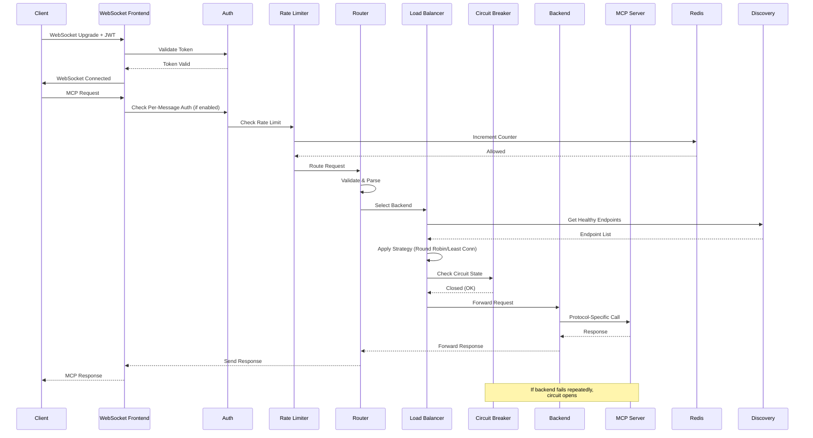
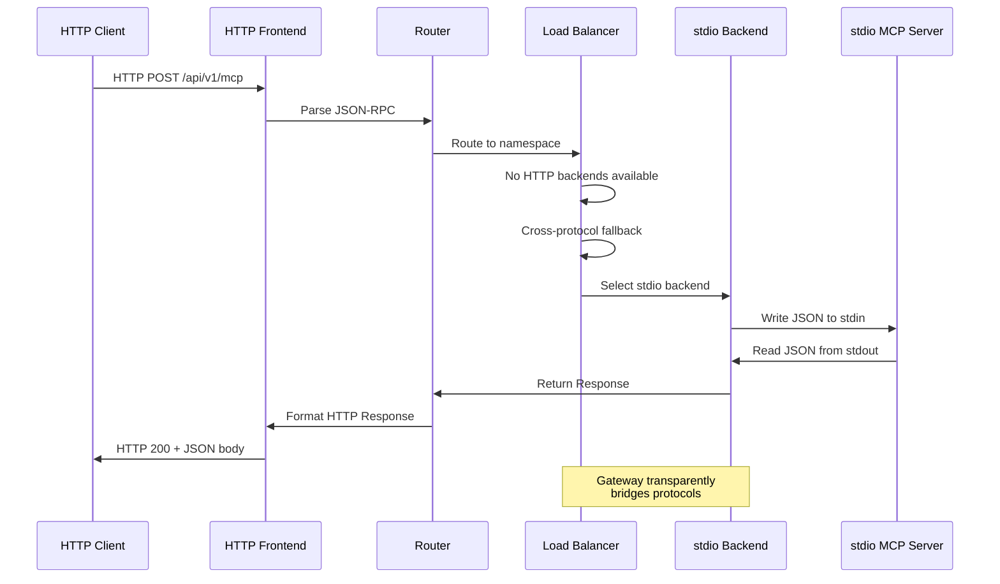
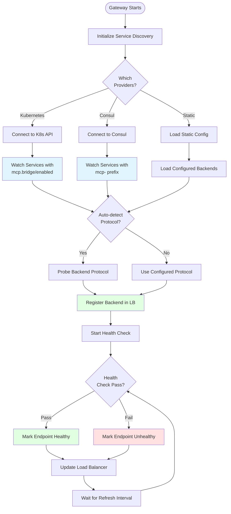
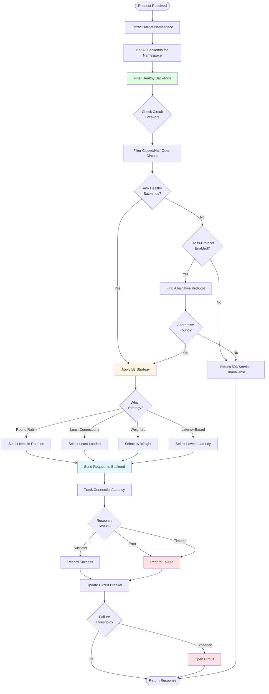
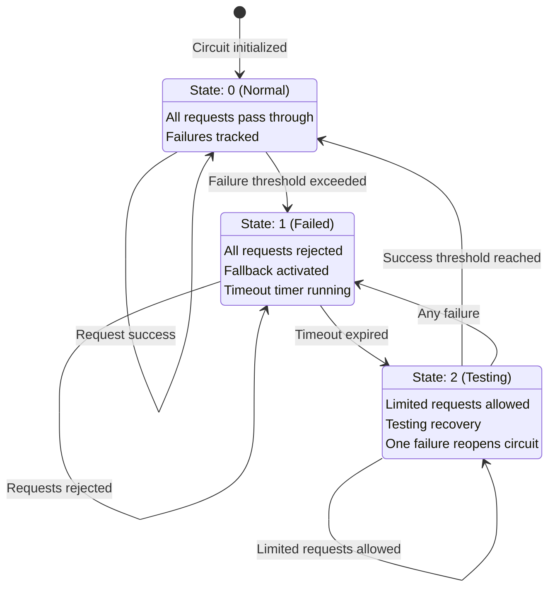
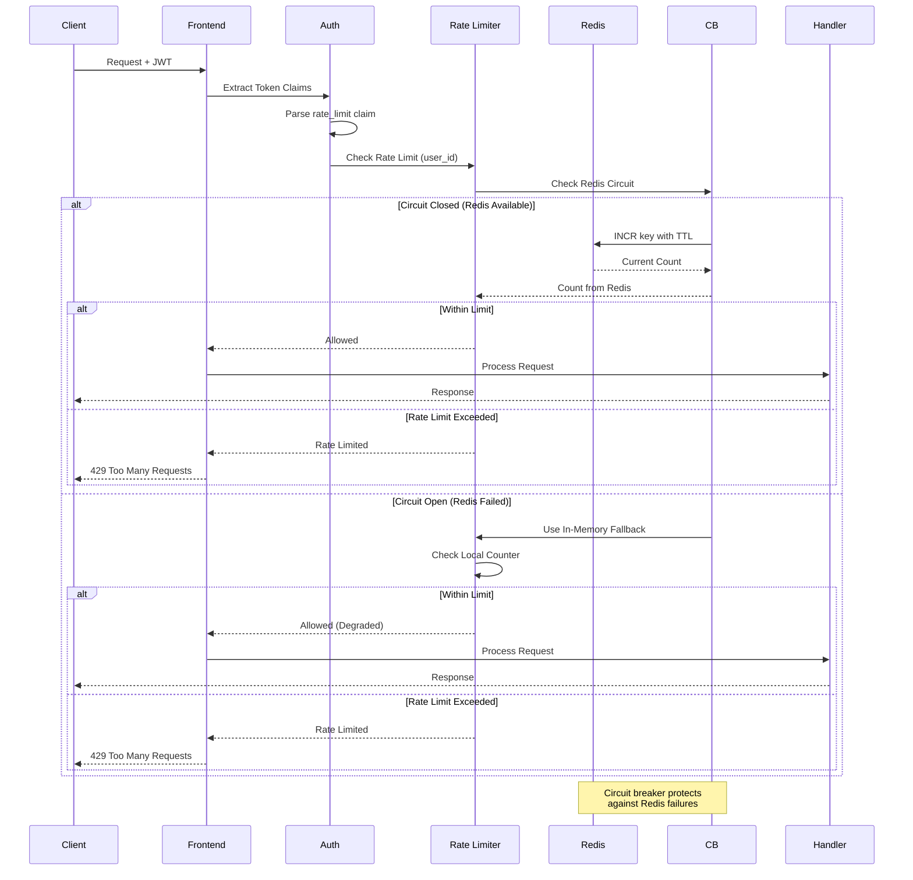
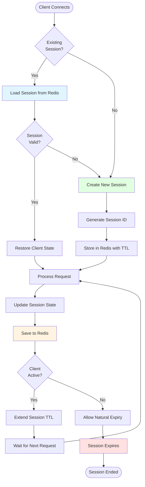

# MCP Gateway Architecture

## Overview

The MCP Gateway is a universal protocol gateway that enables any MCP client to connect to any MCP server regardless of protocol. It provides a high-performance, scalable architecture with comprehensive protocol support, intelligent load balancing, service discovery, and production-ready resilience features.

## Universal Protocol Architecture

```mermaid
graph TB
    subgraph "Client Layer"
        WS_Client[WebSocket Clients]
        HTTP_Client[HTTP/REST Clients]
        SSE_Client[SSE Clients]
        TCP_Client[TCP Binary Clients]
        STDIO_Client[stdio/CLI Clients]
    end

    subgraph "MCP Gateway - Frontend Layer"
        WS_Frontend[WebSocket Frontend<br/>Port 8443]
        HTTP_Frontend[HTTP Frontend<br/>Port 8080]
        SSE_Frontend[SSE Frontend<br/>Port 8081]
        TCP_Frontend[TCP Binary Frontend<br/>Port 8444]
        STDIO_Frontend[stdio Frontend<br/>Unix Socket]
    end

    subgraph "MCP Gateway - Core"
        Auth[Authentication<br/>JWT/OAuth2/mTLS]
        RateLimit[Rate Limiter<br/>Redis/Memory]
        Router[Request Router]
        LB[Load Balancer<br/>Cross-Protocol]
        Discovery[Service Discovery<br/>K8s/Consul/Static]
        CircuitBreaker[Circuit Breaker]
        SessionMgr[Session Manager<br/>Redis-backed]
    end

    subgraph "MCP Gateway - Backend Layer"
        STDIO_Backend[stdio Backend]
        WS_Backend[WebSocket Backend]
        SSE_Backend[SSE Backend]
        HTTP_Backend[HTTP Backend]
        TCP_Backend[TCP Binary Backend]
    end

    subgraph "MCP Server Layer"
        Server1[MCP Server 1<br/>stdio]
        Server2[MCP Server 2<br/>WebSocket]
        Server3[MCP Server 3<br/>SSE]
        Server4[MCP Server 4<br/>HTTP]
        Server5[MCP Server 5<br/>TCP]
    end

    subgraph "Shared State"
        Redis[(Redis)<br/>Sessions/Rate Limiting]
    end

    subgraph "Observability"
        Metrics[Prometheus Metrics<br/>Port 9090]
        Logs[Structured Logging<br/>JSON]
        Health[Health Endpoints<br/>Port 8090]
    end

    WS_Client --> WS_Frontend
    HTTP_Client --> HTTP_Frontend
    SSE_Client --> SSE_Frontend
    TCP_Client --> TCP_Frontend
    STDIO_Client --> STDIO_Frontend

    WS_Frontend --> Auth
    HTTP_Frontend --> Auth
    SSE_Frontend --> Auth
    TCP_Frontend --> Auth
    STDIO_Frontend --> Auth

    Auth --> RateLimit
    RateLimit --> Router
    Router --> LB
    LB --> CircuitBreaker
    CircuitBreaker --> STDIO_Backend
    CircuitBreaker --> WS_Backend
    CircuitBreaker --> SSE_Backend
    CircuitBreaker --> HTTP_Backend
    CircuitBreaker --> TCP_Backend

    Discovery -.->|Updates| LB
    SessionMgr -.->|State| Router
    RateLimit <-.->|Check/Store| Redis
    SessionMgr <-.->|Store/Retrieve| Redis

    STDIO_Backend --> Server1
    WS_Backend --> Server2
    SSE_Backend --> Server3
    HTTP_Backend --> Server4
    TCP_Backend --> Server5

    Router -.->|Export| Metrics
    Auth -.->|Log| Logs
    CircuitBreaker -.->|Report| Health

    style Auth fill:#ffe1e1
    style RateLimit fill:#ffe1e1
    style Router fill:#fff4e1
    style LB fill:#e1f5ff
    style Discovery fill:#e1ffe1
    style CircuitBreaker fill:#ffe1f5
```

## Core Components

### 1. Frontend Layer
Multi-protocol frontend handlers that accept client connections:
- **WebSocket Frontend**: Full bidirectional communication (port 8443)
- **HTTP Frontend**: REST-style request/response (port 8080)
- **SSE Frontend**: Server-Sent Events with dual endpoints (port 8081)
- **TCP Binary Frontend**: High-performance wire protocol (port 8444)
- **stdio Frontend**: Process/CLI integration (Unix socket)

### 2. Authentication & Authorization
Validates and enforces access control:
- JWT token validation with configurable issuers
- OAuth2 token introspection support
- mTLS certificate validation
- Per-message authentication (optional)
- Token claim-based authorization

### 3. Rate Limiting
Multi-layer rate limiting with circuit breaker protection:
- Sliding window algorithm for accurate limiting
- Burst control for traffic spikes
- Redis-backed for distributed state
- Automatic fallback to in-memory
- Per-user and per-IP limits

### 4. Request Router
Protocol-aware message routing:
- Request/response correlation
- Namespace-based routing
- Protocol transformation
- Message validation and sanitization
- Error handling and propagation

### 5. Load Balancer
Intelligent traffic distribution across backends:
- **Cross-Protocol Load Balancing**: Routes across mixed protocol backends
- **Round Robin**: Even distribution
- **Least Connections**: Routes to least loaded endpoint
- **Weighted**: Respects endpoint weights
- **Latency-Based**: Routes based on measured latency

### 6. Service Discovery
Automatic backend discovery and health monitoring:
- **Kubernetes**: Label and annotation-based discovery
- **Consul**: Service catalog integration
- **Static**: Configuration-based backends
- Auto-protocol detection
- Continuous health checks

### 7. Circuit Breaker
Failure detection and graceful degradation:
- Per-endpoint circuit breakers
- Configurable failure thresholds
- Half-open state for recovery testing
- Redis operations protection
- Automatic fallback to in-memory

### 8. Backend Connectors
Protocol-specific backend communication:
- **stdio**: Process spawning and management
- **WebSocket**: Connection pooling and reuse
- **SSE**: Stream management with reconnection
- **HTTP**: Request/response handling
- **TCP Binary**: Wire protocol communication

## Request Flow - WebSocket



## Request Flow - Cross-Protocol



## Service Discovery Flow



## Load Balancing Decision Flow



## Circuit Breaker State Machine



## Rate Limiting Flow



## Session Management



## Authentication Flow

```mermaid
flowchart TD
    Start([Request Received]) --> CheckHeader{Authorization<br/>Header?}

    CheckHeader -->|No| Reject[Reject: 401 Unauthorized]
    CheckHeader -->|Yes| ParseHeader[Parse Bearer Token]

    ParseHeader --> CheckType{Auth<br/>Type?}

    CheckType -->|JWT| ValidateJWT[Validate JWT Signature]
    CheckType -->|OAuth2| IntrospectToken[Introspect OAuth2 Token]
    CheckType -->|mTLS| ValidateCert[Validate Client Certificate]

    ValidateJWT --> CheckExpiry{Token<br/>Expired?}
    IntrospectToken --> CheckExpiry
    ValidateCert --> CheckExpiry

    CheckExpiry -->|Yes| Reject
    CheckExpiry -->|No| CheckClaims[Verify Required Claims]

    CheckClaims --> CheckScopes{Required<br/>Scopes?}

    CheckScopes -->|Missing| Reject2[Reject: 403 Forbidden]
    CheckScopes -->|Present| ExtractLimits[Extract Rate Limit Claims]

    ExtractLimits --> CacheToken{Per-Message<br/>Auth?}

    CacheToken -->|Yes| CacheValidation[Cache Validation (5 min)]
    CacheToken -->|No| Proceed[Proceed to Rate Limiting]

    CacheValidation --> Proceed
    Reject --> End([Return Error])
    Reject2 --> End
    Proceed --> Next([Next Stage])

    style ValidateJWT fill:#e1f5ff
    style CheckClaims fill:#fff4e1
    style ExtractLimits fill:#e1ffe1
    style Reject fill:#ffe1e1
    style Reject2 fill:#ffe1e1
```

## Performance Characteristics

### Throughput
- **112,000 requests/second** sustained throughput (load tested)
- **P50 latency**: 1.8ms at 10,000 concurrent connections
- **P99 latency**: 5.2ms at 10,000 concurrent connections
- Connection pooling for all backend protocols

### Scalability
- **Horizontal scaling**: Shared state via Redis enables unlimited replicas
- **Connection limits**: 50,000+ concurrent WebSocket connections per instance
- **Backend pooling**: Configurable connection pools per backend
- **Automatic discovery**: Dynamically scales with backend additions/removals

### Resource Efficiency
- **Memory**: ~200MB baseline, ~10KB per active connection
- **CPU**: Efficient goroutine-based concurrency
- **Network**: Zero-copy operations where possible
- **Storage**: Redis for shared state (sessions, rate limits, circuit breakers)

## Security Architecture

### Defense in Depth
1. **Network Layer**: TLS 1.3 for all external connections
2. **Transport Layer**: mTLS for backend communication (optional)
3. **Application Layer**: JWT/OAuth2 token validation
4. **Request Layer**: Input validation and sanitization
5. **Rate Limiting**: Multi-layer DoS protection
6. **Circuit Breakers**: Graceful degradation under attack

### Input Validation
- **Request IDs**: UUID format enforcement
- **Method names**: Alphanumeric + underscore only
- **Namespace**: Path injection prevention
- **Message size**: Configurable limits per protocol
- **UTF-8 enforcement**: All string fields validated

### Security Headers
All HTTP responses include:
- `Strict-Transport-Security`: HSTS enforcement
- `Content-Security-Policy`: XSS prevention
- `X-Frame-Options`: Clickjacking prevention
- `X-Content-Type-Options`: MIME sniffing prevention

## Observability

### Metrics (Prometheus)
- **Connection metrics**: Total, active, rejected by protocol
- **Request metrics**: Total, duration, in-flight by method
- **Protocol metrics**: Messages, bytes by protocol and direction
- **Error metrics**: Auth failures, rate limits, protocol errors
- **Circuit breaker metrics**: State changes, success/failure rates
- **Backend metrics**: Request counts, latencies per endpoint

### Logging (Structured JSON)
- **Request/Response logging**: Trace ID correlation
- **Auth events**: Successes and failures with reasons
- **Service discovery**: Backend additions/removals
- **Circuit breaker**: State changes and reasons
- **Error details**: Full stack traces for debugging

### Health Checks
- **Overall health**: `/health` - All subsystems
- **Liveness**: `/healthz` - Process alive
- **Readiness**: `/ready` - Ready for traffic
- **Frontend health**: `/health/frontend/{protocol}`
- **Backend health**: `/health/backend/{name}`
- **Component health**: `/health/components` - Redis, discovery, etc.

## Future Enhancements

### Planned Features
1. **Request Priority**: Priority queues for critical requests
2. **Advanced Routing**: Content-based routing rules
3. **Protocol Translation**: Automatic protocol negotiation
4. **Distributed Tracing**: Full OpenTelemetry integration
5. **Request Deduplication**: Idempotency key support
6. **A/B Testing**: Traffic splitting for canary deployments

### Extensibility
- **Plugin system**: Custom authentication providers
- **Middleware pipeline**: Request/response transformation
- **Custom metrics**: User-defined metric exporters
- **Protocol adapters**: Support for additional protocols
