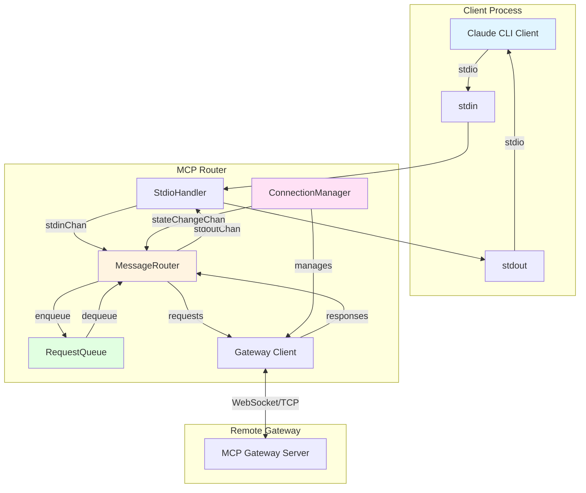
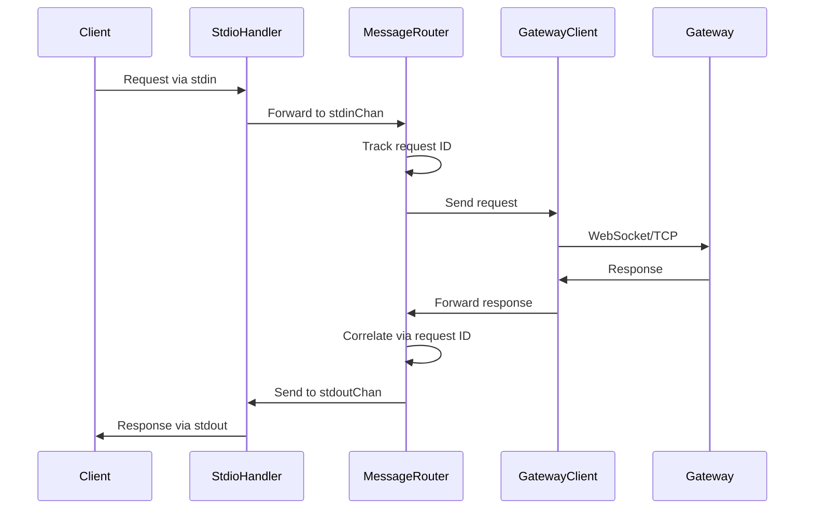
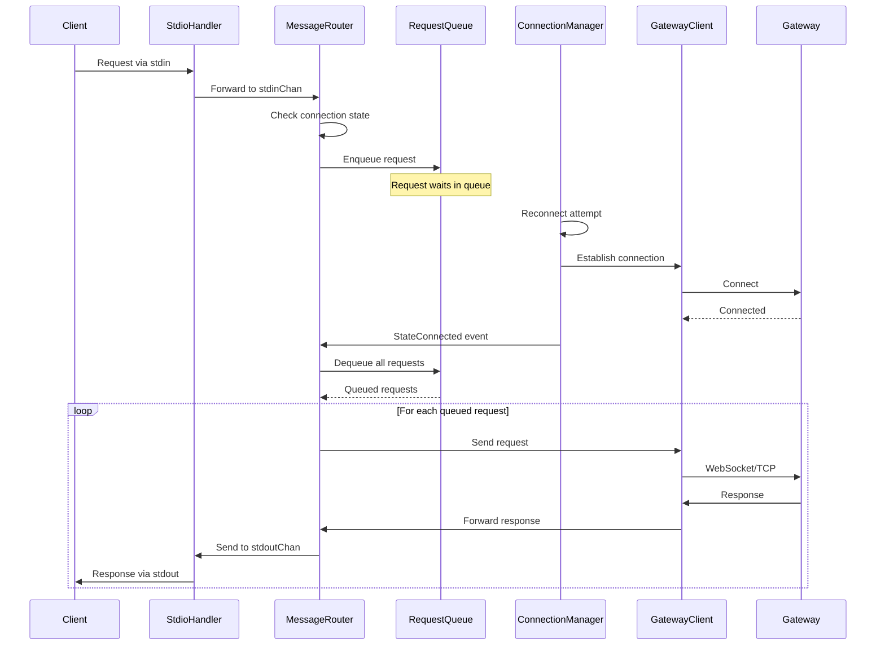
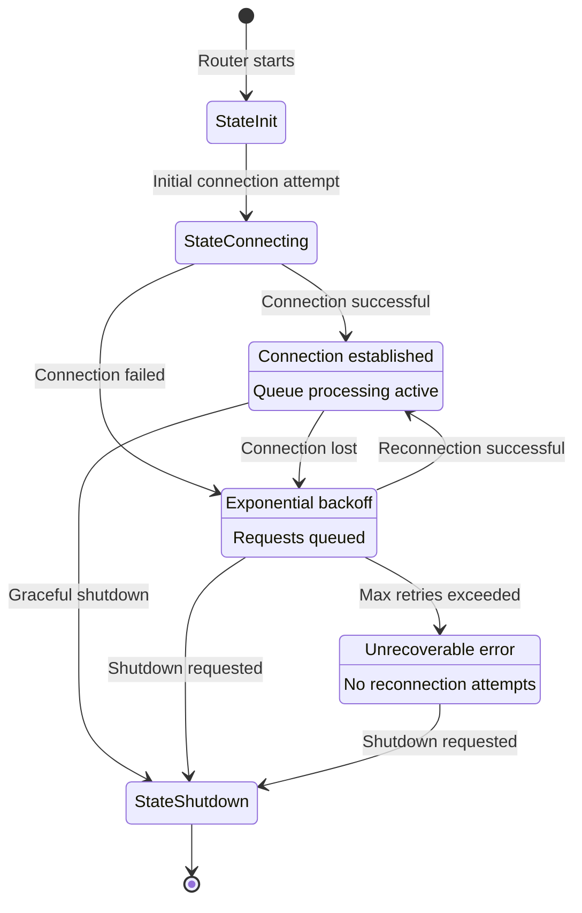
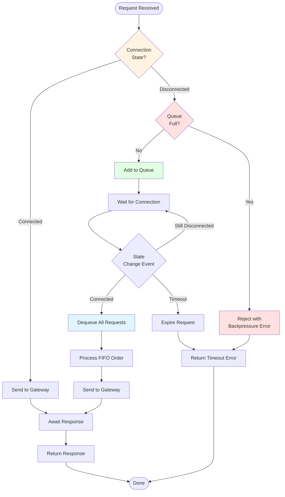

# MCP Router Architecture

## Overview

The MCP Router is designed as a high-performance, event-driven bridge between Claude CLI's stdio interface and remote MCP gateway servers. It implements a clean separation of concerns with modular components for connection management, message routing, and request queueing.

## Core Components

### 1. LocalRouter (`router.go`)
The main orchestrator that:
- Manages the lifecycle of all router components
- Coordinates between stdio handler, message router, and connection manager
- Handles graceful shutdown and cleanup

### 2. MessageRouter (`message_router.go`)
Responsible for:
- Routing messages between stdin/stdout and WebSocket/TCP connections
- Request/response correlation using message IDs
- Rate limiting enforcement
- Request queueing when disconnected

Key features:
- **Event-driven processing**: No polling loops or busy waiting
- **Concurrent request handling**: Thread-safe request tracking
- **Automatic queue processing**: Processes queued requests when connection is established

### 3. ConnectionManager (`connection_manager.go`)
Manages the WebSocket/TCP connection lifecycle:
- Establishes initial connection to gateway
- Handles automatic reconnection with exponential backoff
- Monitors connection health
- **Publishes state changes via event channel** (no polling required)

Connection states:
- `StateInit`: Initial state before connection attempt
- `StateConnecting`: Active connection attempt in progress
- `StateConnected`: Successfully connected to gateway
- `StateReconnecting`: Connection lost, attempting to reconnect
- `StateError`: Unrecoverable error occurred
- `StateShutdown`: Router is shutting down

### 4. RequestQueue (`request_queue.go`)
A thread-safe FIFO queue for requests:
- **Configurable capacity**: Prevents unbounded memory growth
- **Backpressure handling**: Rejects requests when full
- **Timeout support**: Respects request timeouts even while queued
- **Metrics tracking**: Monitors queued, processed, and dropped requests

## Architecture Diagram



## Data Flow

### Request Flow (Connected State)



### Request Flow (Disconnected State)



## Connection State Machine



## Event-Driven Architecture

The router is fully event-driven with no polling loops:

### State Change Notifications
- ConnectionManager publishes state changes to a buffered channel
- MessageRouter subscribes to state changes
- Queue processing triggered by `StateConnected` transition

### Channel Communication
All component communication uses Go channels:
- `stdinChan`: Carries requests from stdio to message router
- `stdoutChan`: Carries responses from message router to stdio
- `stateChangeChan`: Carries connection state transitions
- `pendingReqs`: Maps request IDs to response channels for correlation

## Passive Initialization Mode

The router operates in passive mode for MCP initialization:

### Traditional Behavior (Disabled)
```go
// Router would automatically send initialization when connected
// This caused duplicate initialization issues
```

### Current Behavior (Passive)
```go
// Router waits for client to send initialization
// Simply forwards the client's initialization request to gateway
// No protocol-level decisions made by router
```

This ensures:
- Client maintains control over protocol flow
- No duplicate initialization requests
- True proxy behavior (transparent to protocol)

## Request Queueing Strategy

### Queue Processing Flow



### Queue Behavior
1. **Enqueue**: When not connected, requests are added to queue
2. **Process**: When connection established, all queued requests processed in FIFO order
3. **Reject**: When queue full, new requests rejected with backpressure error

### Configuration
```yaml
local:
  max_queued_requests: 100  # Maximum queue size
  request_timeout_ms: 30000  # Timeout for queued requests
```

### Backpressure Handling
When the queue is full:
- New requests immediately rejected
- Error returned to client
- Prevents memory exhaustion
- Client can implement retry logic

## Connection Management

### Automatic Reconnection
The ConnectionManager implements exponential backoff with jitter:
```go
backoff = initialDelay * (multiplier ^ attempts) + jitter
```

Configuration:
- Initial delay: 1 second
- Maximum delay: 60 seconds
- Multiplier: 2.0
- Jitter: ±10%
- Maximum attempts: 10 (configurable)

### Connection Pooling
For high-throughput scenarios, the router supports connection pooling:
- Maintains multiple gateway connections
- Load balances requests across connections
- Health checks for connection validity
- Automatic cleanup of expired connections

## Performance Optimizations

### Zero-Copy Operations
- Direct channel passing of byte slices
- Minimal data copying between components
- Efficient memory usage

### Concurrent Processing
- Goroutines for each major component
- Non-blocking channel operations where possible
- Thread-safe data structures (sync.Map, sync.RWMutex)

### Resource Management
- Bounded queues prevent memory exhaustion
- Timeout enforcement prevents resource leaks
- Graceful shutdown ensures clean resource cleanup

## Error Handling

### Error Propagation
Errors are propagated through the system via:
1. Return values for synchronous operations
2. Error channels for asynchronous operations
3. Response error fields for protocol-level errors

### Error Recovery
- Automatic reconnection for transient network errors
- Request requeuing for connection failures
- Circuit breaker pattern for repeated failures

## Metrics and Observability

The router exposes detailed metrics:

### Request Metrics
- `mcp_router_requests_total`: Total requests processed
- `mcp_router_requests_queued`: Current queue depth
- `mcp_router_requests_dropped`: Requests dropped due to queue full

### Connection Metrics
- `mcp_router_connection_state`: Current connection state
- `mcp_router_reconnection_attempts`: Total reconnection attempts
- `mcp_router_connection_duration`: Time in each state

### Performance Metrics
- `mcp_router_request_duration_seconds`: Request processing time
- `mcp_router_queue_wait_time_seconds`: Time spent in queue

## Security Considerations

### Authentication
- Per-message authentication token injection
- Support for multiple auth methods (Bearer, mTLS, OAuth2)
- Secure credential storage using platform-native stores

### TLS Security
- TLS 1.3 by default
- Custom CA certificate support
- Certificate validation and hostname verification

### Rate Limiting
- Token bucket algorithm for smooth rate limiting
- Configurable requests per second and burst size
- Per-client rate limiting support

## Future Enhancements

### Planned Improvements
1. **Request Priority**: Priority queue for important requests
2. **Circuit Breaker Enhancement**: More sophisticated failure detection
3. **Distributed Tracing**: OpenTelemetry support
4. **Request Deduplication**: Prevent duplicate request processing
5. **Adaptive Backoff**: Dynamic backoff based on error patterns

### Extensibility Points
- Plugin system for custom authentication methods
- Middleware pipeline for request/response transformation
- Custom metrics exporters
- Protocol adapters for non-MCP protocols