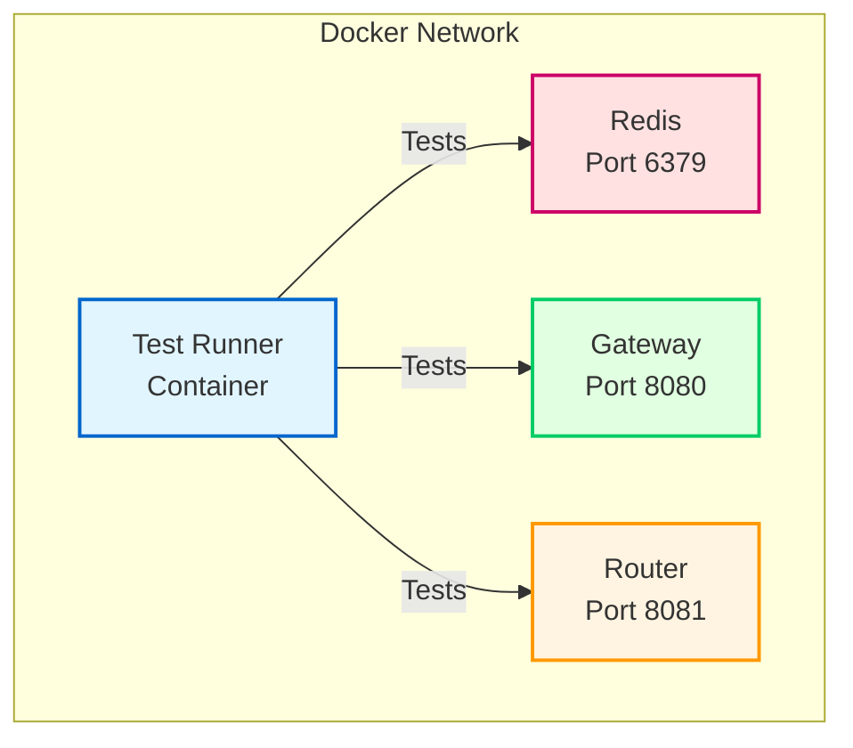

# Production-Ready Testing Guide

This guide explains how to run production-ready tests for MCP Bridge using Docker containers with real services.

## Quick Start

```bash
# Run all tests with real services in Docker
make -f Makefile.test test-docker

# Run quick smoke tests (< 2 minutes)
make -f Makefile.test test-docker-quick

# Run full test suite (~ 10 minutes)
make -f Makefile.test test-docker-full

# Run CI pipeline
make -f Makefile.test test-ci
```

## Architecture

The production test setup uses Docker Compose to spin up:

1. **Real Services**:
   - Gateway service (port 8080)
   - Router service (port 8081)
   - Redis (port 6379)

2. **Test Runner Container**:
   - Runs tests against real services
   - Isolated environment
   - Consistent dependencies



## Test Types

### 1. Integration Tests
Tests real service interactions:
```bash
# Run integration tests with Docker
make -f Makefile.test test-integration

# Or using docker-test.sh directly
./test/docker-test.sh -t integration
```

### 2. Smoke Tests
Quick validation of critical functionality:
```bash
# Docker-based smoke tests
make -f Makefile.test test-docker-quick

# Keep environment running for debugging
./test/docker-test.sh -t smoke -k
```

### 3. Contract Tests
API contract validation:
```bash
# Contract tests with real services
make -f Makefile.test test-contract-docker
```

### 4. Performance Tests
Performance benchmarking and regression:
```bash
# Performance tests
make -f Makefile.test test-performance-docker

# Load tests
make -f Makefile.test test-load
```

## Docker Test Environment

### Starting Test Environment

```bash
# Start all test services
make -f Makefile.test test-up

# Services will be available at:
# - Gateway: http://localhost:8080
# - Router: http://localhost:8081  
# - Redis: localhost:6379

# Check service health
curl http://localhost:8080/health
curl http://localhost:8081/health
```

### Running Tests Against Running Environment

```bash
# With services already running
GATEWAY_URL=http://localhost:8080 \
ROUTER_URL=http://localhost:8081 \
REDIS_URL=localhost:6379 \
go test -v ./test/integration
```

### Debugging Test Environment

```bash
# View logs
make -f Makefile.test test-logs

# Shell into test container
make -f Makefile.test test-shell

# View specific service logs
docker-compose -f docker-compose.test.yml logs gateway
docker-compose -f docker-compose.test.yml logs router
```

### Stopping Test Environment

```bash
# Stop and clean up
make -f Makefile.test test-down

# Or keep data volumes
docker-compose -f docker-compose.test.yml stop
```

## CI/CD Integration

### GitHub Actions

```yaml
name: Tests

on: [push, pull_request]

jobs:
  test:
    runs-on: ubuntu-latest
    
    steps:
    - uses: actions/checkout@v3
    
    - name: Set up Go
      uses: actions/setup-go@v4
      with:
        go-version: '1.21'
    
    - name: Run tests
      run: make -f Makefile.test test-github-actions
    
    - name: Upload test results
      if: always()
      uses: actions/upload-artifact@v3
      with:
        name: test-results
        path: reports/
```

### Jenkins

```groovy
pipeline {
    agent any
    
    stages {
        stage('Build') {
            steps {
                sh 'make -f Makefile.test test-build'
            }
        }
        
        stage('Test') {
            parallel {
                stage('Unit Tests') {
                    steps {
                        sh 'make -f Makefile.test test-unit'
                    }
                }
                stage('Integration Tests') {
                    steps {
                        sh 'make -f Makefile.test test-integration'
                    }
                }
            }
        }
        
        stage('Cleanup') {
            always {
                sh 'make -f Makefile.test test-down'
            }
        }
    }
}
```

### GitLab CI

```yaml
stages:
  - build
  - test
  - cleanup

test:
  stage: test
  services:
    - docker:dind
  script:
    - make -f Makefile.test test-ci
  artifacts:
    reports:
      junit: reports/test-results.xml
    paths:
      - reports/
```

## Test Configuration

### Environment Variables

```bash
# Service URLs
export GATEWAY_URL=http://gateway:8080
export ROUTER_URL=http://router:8081
export REDIS_URL=redis:6379

# Authentication
export MCP_AUTH_TOKEN=test-token-12345

# Test configuration
export TEST_LEVEL=standard  # quick, standard, full
export TEST_TYPE=all        # smoke, integration, contract, performance, all
export TEST_TIMEOUT=300     # Timeout in seconds

# Docker configuration
export COMPOSE_PROJECT=mcp-test
export COMPOSE_FILE=docker-compose.test.yml
```

### Test Configurations

Test configurations are in `configs/test/`:
- `gateway.yaml` - Gateway test configuration
- `router.yaml` - Router test configuration

## Performance Testing

### Running Benchmarks

```bash
# Run benchmarks
make -f Makefile.test test-benchmark

# Compare with baseline
make -f Makefile.test test-benchmark-compare
```

### Load Testing

```bash
# Run load tests (requires services running)
make -f Makefile.test test-load

# Or with specific parameters
LOAD_USERS=1000 LOAD_DURATION=5m \
  go test -v ./test/load
```

## Troubleshooting

### Services Not Starting

```bash
# Check Docker daemon
docker info

# Check service logs
docker-compose -f docker-compose.test.yml logs gateway
docker-compose -f docker-compose.test.yml logs router

# Rebuild images
docker-compose -f docker-compose.test.yml build --no-cache
```

### Tests Failing

```bash
# Run with verbose output
./test/docker-test.sh -v -t smoke

# Check service health
curl http://localhost:8080/health
curl http://localhost:8081/health

# Verify Redis connection
redis-cli ping
```

### Port Conflicts

```bash
# Check what's using ports
lsof -i :8080
lsof -i :8081
lsof -i :6379

# Use different ports
GATEWAY_PORT=8090 ROUTER_PORT=8091 \
  docker-compose -f docker-compose.test.yml up
```

### Cleanup Issues

```bash
# Force cleanup
docker-compose -f docker-compose.test.yml down -v --remove-orphans

# Remove all test containers
docker ps -a | grep mcp-test | awk '{print $1}' | xargs docker rm -f

# Clean test data
make -f Makefile.test test-clean-all
```

## Best Practices

### 1. Always Use Docker for Testing
- Ensures consistent environment
- Tests against real services
- Matches production setup

### 2. Test Levels
- **Quick**: Pre-commit hooks (< 2 min)
- **Standard**: PR validation (< 5 min)
- **Full**: Nightly/release (< 30 min)

### 3. Test Isolation
- Each test should be independent
- Clean up test data after each test
- Use unique identifiers for test data

### 4. CI/CD Integration
- Run quick tests on every commit
- Run full suite on PR merge
- Run load tests nightly

### 5. Performance Baselines
- Maintain performance baselines
- Alert on regressions > 10%
- Update baselines quarterly

## Development Workflow

### 1. Pre-commit Testing
```bash
# Run before committing
make -f Makefile.test test-pre-commit
```

### 2. Feature Development
```bash
# Start test environment
make -f Makefile.test test-up

# Run tests in watch mode
make -f Makefile.test test-watch-local

# Run specific test
go test -v ./test/integration -run TestHealthEndpoints
```

### 3. Pre-merge Validation
```bash
# Full validation before merging
make -f Makefile.test test-pre-merge
```

### 4. Release Testing
```bash
# Comprehensive release validation
make -f Makefile.test test-docker-full
make -f Makefile.test test-load
make -f Makefile.test test-benchmark
```

## Monitoring Test Results

### Test Reports
Reports are generated in `reports/` directory:
- `test-results.json` - JSON test results
- `coverage.html` - Code coverage report
- `benchmark.txt` - Performance benchmarks

### Metrics
Test metrics are available at:
- Test duration trends
- Pass/fail rates
- Performance regression alerts
- Coverage trends

## Extending Tests

### Adding New Integration Tests

```go
func (s *IntegrationTestSuite) TestNewFeature() {
    // Test against real services
    resp, err := s.client.Post(s.gatewayURL+"/new-endpoint", ...)
    s.Require().NoError(err)
    s.Assert().Equal(http.StatusOK, resp.StatusCode)
}
```

### Adding New Services

Update `docker-compose.test.yml`:
```yaml
services:
  new-service:
    build: ./services/new-service
    depends_on:
      - gateway
    healthcheck:
      test: ["CMD", "curl", "-f", "http://localhost:8082/health"]
```

## Support

For issues:
1. Check service logs: `make -f Makefile.test test-logs`
2. Verify health: `curl http://localhost:8080/health`
3. Clean and rebuild: `make -f Makefile.test test-clean-all test-build`
4. Contact platform team

## Summary

The production-ready test setup provides:
- ✅ Real service testing with Docker
- ✅ Consistent test environment
- ✅ CI/CD integration
- ✅ Performance benchmarking
- ✅ Easy debugging
- ✅ Production parity

Use `make -f Makefile.test test-docker` for reliable, production-ready testing!