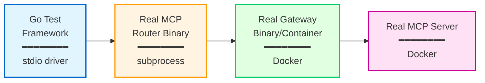

# Full Stack End-to-End Tests

This directory contains comprehensive end-to-end tests that verify the complete MCP Bridge system using real binaries and infrastructure.

## Architecture

The E2E tests use a hybrid approach that combines realistic infrastructure with programmatic testing:



## Components

- **full_stack_test.go**: Main test suite with comprehensive scenarios
- **router_controller.go**: Manages router binary subprocess lifecycle
- **docker_stack.go**: Orchestrates Docker services (gateway + MCP servers)
- **mcp_client.go**: MCP protocol helpers and utilities
- **test-mcp-server/**: Enhanced MCP server for testing multiple tools
- **configs/**: Test configurations for router, gateway, and auth

## Test Scenarios

1. **Basic MCP Flow**: Initialize → List Tools → Execute Tool
2. **Multi-Server Routing**: Test routing to different MCP server namespaces
3. **Authentication**: Real JWT token validation with gateway
4. **Network Resilience**: Restart gateway, test automatic reconnection
5. **Error Propagation**: Invalid requests, server failures, timeouts
6. **Concurrent Operations**: Multiple simultaneous tool executions

## Running Tests

```bash
# Run full E2E test suite
make test-e2e-full

# Run individual test scenarios
cd test/e2e/full_stack
go test -v -run TestBasicMCPFlow
go test -v -run TestMultiServerRouting
go test -v -run TestNetworkResilience
```

## Prerequisites

- Docker and Docker Compose
- Go 1.21+
- Built router and gateway binaries

## Test Execution Time

- Setup: ~30-60 seconds (Docker services start)
- Test execution: ~2-3 minutes
- Cleanup: ~10 seconds
- **Total**: ~3-4 minutes

## Success Verification

Tests use standard Go testing framework with:
- Structured assertions (`require.NoError`, `assert.Equal`)
- MCP response validation
- Timing verification (latency bounds)
- Log analysis
- Clear pass/fail with detailed error messages