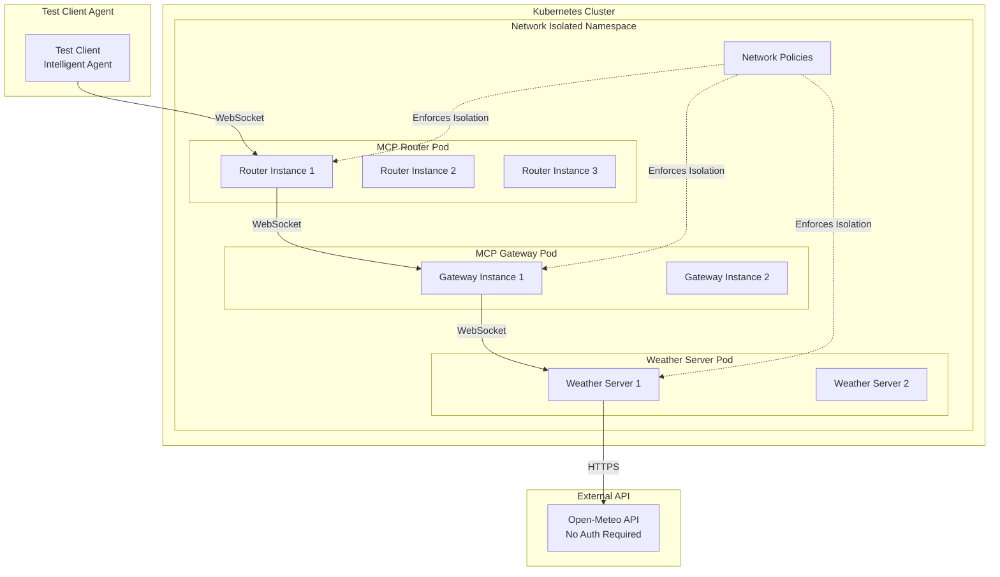

# Weather MCP E2E Test Suite

## Overview

This is a production-ready, comprehensive end-to-end test suite for the MCP Gateway and Router using a real Weather MCP server that integrates with the Open-Meteo API. The test suite validates the complete MCP protocol flow, network isolation, security, observability, and performance characteristics of the system.

## Architecture



## Features

### Weather MCP Server
- **Production-ready implementation** with comprehensive error handling
- **Open-Meteo API integration** - no authentication required
- **Circuit breaker pattern** for API resilience
- **Rate limiting** per connection
- **Health checks** and readiness probes
- **Prometheus metrics** export
- **WebSocket keepalive** with ping/pong
- **Graceful shutdown** handling

### Test Suite
- **Complete Kubernetes deployment** with network isolation
- **Network policies** enforcing strict communication paths
- **Security validation** including auth and TLS
- **Load testing** with concurrent clients
- **Observability validation** (metrics, logs, traces)
- **Error handling scenarios**
- **Performance benchmarking**
- **Automated cleanup and teardown**

## Prerequisites

- Go 1.21+
- Docker
- Kubernetes cluster (Kind for local testing)
- kubectl
- make

## Quick Start

### 1. Run Complete E2E Test

```bash
# Run the full E2E test suite with automatic setup and teardown
make e2e-test
```

### 2. Run in CI Environment

```bash
# Optimized for CI/CD pipelines
make e2e-test-ci
```

### 3. Development Testing

```bash
# Quick development test
make dev-test

# With debugging
make debug
```

## Detailed Usage

### Building Components

```bash
# Build Go binaries
make build

# Build Docker images
make docker-build

# Push to registry
make docker-push
```

### Cluster Management

```bash
# Create Kind cluster
make cluster-create

# Load images into cluster
make cluster-load-images

# Delete cluster
make cluster-delete
```

### Deployment

```bash
# Deploy all components
make k8s-deploy

# Teardown deployment
make k8s-teardown
```

### Testing

```bash
# Unit tests
make test-unit

# Integration tests
make test-integration

# E2E tests
make e2e-test

# Load testing
make load-test

# Stress testing
make stress-test

# Chaos testing
make chaos-test
```

### Monitoring and Debugging

```bash
# View logs
make logs

# Start debug session with port forwarding
make debug

# Open monitoring dashboards
make monitor
```

## Test Scenarios

### 1. Basic MCP Flow
- Initialize connection
- List available tools
- Execute weather queries
- Verify responses

### 2. Client Agent Interaction
- Intelligent agent connects to system
- Performs multiple weather queries
- Tests forecast functionality
- Validates data accuracy

### 3. Error Handling
- Invalid method requests
- Malformed parameters
- Network failures
- API unavailability

### 4. Load Testing
- 50 concurrent clients
- 20 requests per client
- Measures error rate
- Validates performance under load

### 5. Security Validation
- Unauthorized access attempts
- Network policy enforcement
- Authentication validation
- TLS configuration

### 6. Observability
- Metrics endpoint validation
- Custom metrics verification
- Log collection
- Distributed tracing

## Network Isolation

The test implements strict network isolation using Kubernetes NetworkPolicies:

1. **Weather Server**: Only accepts connections from Gateway
2. **Gateway**: Only accepts connections from Router
3. **Router**: Accepts external client connections
4. **Default Deny**: All other traffic is blocked

## Configuration

### Weather Server Config
```yaml
port: 8080
metrics_enabled: true
rate_limit_enabled: true
requests_per_minute: 1000
circuit_breaker_enabled: true
failure_threshold: 5
```

### Gateway Config
```yaml
upstream:
  endpoints:
    - url: ws://weather-mcp-server:8080/mcp
  circuit_breaker:
    enabled: true
security:
  rate_limit:
    enabled: true
```

### Router Config
```yaml
gateway:
  url: ws://mcp-gateway:8080
  reconnect:
    enabled: true
resilience:
  circuit_breaker:
    enabled: true
```

## Metrics

The test suite exports comprehensive metrics:

- **Request/Response counts**
- **Error rates**
- **Latency percentiles** (P50, P95, P99)
- **Active connections**
- **API call statistics**
- **Circuit breaker state**

## CI/CD Integration

### GitHub Actions Example

```yaml
name: E2E Tests
on: [push, pull_request]
jobs:
  e2e:
    runs-on: ubuntu-latest
    steps:
      - uses: actions/checkout@v3
      - uses: actions/setup-go@v4
        with:
          go-version: '1.21'
      - name: Run E2E Tests
        run: make e2e-test-ci
```

### Jenkins Pipeline

```groovy
pipeline {
    agent any
    stages {
        stage('E2E Test') {
            steps {
                sh 'make e2e-test-ci'
            }
        }
    }
    post {
        always {
            sh 'make logs'
            sh 'make clean'
        }
    }
}
```

## Troubleshooting

### Common Issues

1. **Cluster creation fails**
   ```bash
   # Check Docker is running
   docker info
   
   # Delete existing cluster
   make cluster-delete
   ```

2. **Images not loading**
   ```bash
   # Check local registry
   docker images
   
   # Rebuild images
   make docker-build
   ```

3. **Pods not starting**
   ```bash
   # Check pod status
   kubectl get pods -n mcp-weather-test
   
   # View pod logs
   make logs
   ```

4. **Tests timing out**
   ```bash
   # Increase timeout
   make e2e-test TIMEOUT=20m
   
   # Check connectivity
   make debug
   ```

## Performance Benchmarks

Expected performance characteristics:

- **Latency**: P95 < 100ms, P99 < 200ms
- **Throughput**: >1000 requests/second
- **Error Rate**: <1% under normal load
- **Recovery Time**: <30s after failure
- **Memory Usage**: <512MB per component
- **CPU Usage**: <500m per component

## Security Considerations

- **No hardcoded secrets** - uses environment variables
- **Network isolation** - strict NetworkPolicies
- **Non-root containers** - security context enforced
- **Read-only filesystems** - prevents runtime modifications
- **Resource limits** - prevents resource exhaustion
- **Security scanning** - integrated in CI pipeline

## Contributing

1. Fork the repository
2. Create a feature branch
3. Write tests for new functionality
4. Ensure all tests pass
5. Submit a pull request

## License

This test suite is part of the MCP Bridge project and follows the same license.

## Support

For issues or questions:
- Open an issue in the GitHub repository
- Check the troubleshooting section
- Review the logs with `make logs`
- Use `make debug` for interactive debugging